# LMS Portal Addons — Investigation, Proposal & Implementation

> **Status:** ✅ **Implemented** (2026-07-14) · **Date:** 2026-07-14
> **Author:** GitHub Copilot
> **Purpose:** Catalogue functionality added to the LMS portal as
> admin-toggleable addons, with architecture, effort, and priority for each.
>
> **Implementation:** All 20 addons are built, registered, and tested.
> See [§ Implementation status](#9-implementation-status) for the file map.

---

## 1. Current state summary

The LMS SaaS app (`lms_saas`) is a microfinance loan management platform built
on Frappe + ERPNext + Lending + HRMS. The portal currently exposes these
surfaces:

| Route | Persona | Function |
|-------|---------|----------|
| `/lms` | Borrower | My Loans dashboard, summary, charts |
| `/lms/apply` | Borrower | Loan application form |
| `/lms/pay` | Borrower | Online repayment (EcoCash, OneMoney, bank transfer) |
| `/lms/applications` | Borrower | Application history |
| `/lms/loan` | Borrower | Single loan detail + schedule + repayments |
| `/lms/account` | Borrower | Profile, password, preferences |
| `/lms/collect` | Collector | Field collection PWA (offline-capable run sheet) |
| `/lms/officer` | Loan Officer | Dashboard, borrowers, loans, leads, reports |
| `/lms/manager` | Branch Manager | Dashboard, approvals, borrowers, loans, reports, collateral, team |
| `/lms-help` | All | Staff/admin help docs |

**Personas supported:** Borrower, Admin, Loan Officer, Collector, Branch Manager.

**Existing LMS doctypes:** Borrower Compliance, Collateral, Credit Policy/Rule,
Lending Group/Member/Meeting/Center, Savings Account/Transaction, Investor/
Investor Transaction, Payment Intent/Provider/Reconciliation, Audit Event,
Incident Log, Notification Log, Webhook Subscription, API Key, User Setup.

**Installed but NOT exposed in the portal:**

| App | Available modules not surfaced |
|-----|-------------------------------|
| **HRMS** | Employee, Leave, Attendance, Expense Claim, Payroll, Appraisals, Recruitment, Training, Shifts, Travel, Grievance, Onboarding/Separation |
| **ERPNext** | Accounts (full GL), Buying/Procurement, Stock/Inventory, Selling, Projects, Support/Helpdesk, Assets, CRM (partially used for Leads) |

The proposal below identifies **20 addon modules** that can be built as
admin-toggleable portal extensions, reusing the existing HRMS/ERPNext doctypes
wherever possible (no new Frappe core modifications) and following the
established `lms_saas` patterns (persona-aware guards, `site_config` feature
flags, branded portal shell, audit trail).

---

## 2. Addon architecture (how toggles work)

### 2.1 Feature flag pattern

All addons follow the existing `site_config` pattern already used for
`lms_payments_enabled`, `lms_collections_escalation_enabled`, etc.

```jsonc
// site_config.json
{
  "lms_addons": {
    "hr_management": true,
    "payroll": false,
    "appraisals": true,
    "recruitment": false,
    "training": true,
    "inventory": false,
    "procurement": true,
    "helpdesk": true,
    "savings_club": true,
    "insurance": false,
    "budgeting": false,
    "document_center": true,
    "task_management": true,
    "announcements": true,
    "branch_analytics": true,
    "customer_feedback": true,
    "field_visits": true,
    "regulatory_hub": true,
    "whatsapp": false,
    "wallet_recon": false
  }
}
```

### 2.2 Central addon registry

A new `lms_saas/utils/addons.py` module reads the `lms_addons` config and
exposes a single `is_addon_enabled(addon_key)` helper used by:

- `utils/brand.py:_build_lms_nav()` — conditionally add nav items
- `boot.py:apply_default_route()` — include addon routes in boot payload
- Each addon's API guard — refuse calls when the addon is off
- `install.py` — seed addon-specific roles, doctypes, workspace cards

```python
# lms_saas/utils/addons.py (proposed)
import frappe

ADDON_REGISTRY = {
    "hr_management": {
        "label": "HR Management",
        "icon": "users",
        "route": "/lms/hr",
        "personas": ["Branch Manager", "Admin"],
        "description": "Leave approvals, attendance, expense claims, team schedules",
    },
    "payroll": {
        "label": "Payroll",
        "icon": "wallet",
        "route": "/lms/payroll",
        "personas": ["Admin", "Branch Manager"],
        "description": "Salary slips, payroll runs, payslip distribution",
    },
    # ... 18 more entries
}

def is_addon_enabled(key: str) -> bool:
    addons = frappe.conf.get("lms_addons") or {}
    return bool(addons.get(key, False))

def get_enabled_addons() -> list[dict]:
    return [
        {**spec, "key": k}
        for k, spec in ADDON_REGISTRY.items()
        if is_addon_enabled(k)
    ]
```

### 2.3 Portal page pattern

Each addon gets a `www/lms/<addon>.py` + `.html` pair following the existing
pattern:

```python
# www/lms/hr.py (proposed)
import frappe
from lms_saas.utils.brand import apply_portal_context
from lms_saas.utils.addons import is_addon_enabled

no_cache = 1

def get_context(context):
    if frappe.session.user == "Guest":
        frappe.local.flags.redirect_location = "/login?redirect-to=/lms/hr"
        raise frappe.Redirect
    if not is_addon_enabled("hr_management"):
        frappe.local.flags.redirect_location = "/lms"
        raise frappe.Redirect
    return apply_portal_context(context, nav_active="hr", page_js="js/lms_hr_portal.js")
```

### 2.4 API guard pattern

```python
# api/hr.py (proposed)
def _require_hr_addon():
    from lms_saas.utils.addons import is_addon_enabled
    if not is_addon_enabled("hr_management"):
        frappe.throw("HR Management addon is not enabled.", frappe.PermissionError)
    # ... persona check (Branch Manager / Admin)
```

---

## 3. Proposed addons (20 modules)

### Priority tiers

| Tier | Meaning | Effort |
|------|---------|--------|
| **P0** | High value, low effort (reuses existing doctypes heavily) | 2–5 days |
| **P1** | High value, moderate effort | 5–10 days |
| **P2** | Medium value or higher effort | 10–20 days |

---

### 3.1 HR Management for Managers (P0)

**Addon key:** `hr_management`

**Who uses it:** Branch Manager, Admin

**What it does:**
- **Leave approvals** — View pending leave applications from branch staff;
  approve/reject with comments. Uses HRMS `Leave Application` doctype.
- **Attendance overview** — See today's attendance for the branch team;
  identify absentees and late check-ins. Uses HRMS `Attendance` /
  `Employee Checkin`.
- **Expense claim approvals** — Review and approve staff expense claims
  (travel, field collection costs, client meetings). Uses HRMS `Expense Claim`.
- **Shift management** — View and assign shift schedules for collectors and
  officers. Uses HRMS `Shift Assignment` / `Shift Request`.
- **Team directory** — Roster of branch staff with contact details,
  designations, personas, and linked loans.

**Why it fits:**
HRMS is already a required app (`hooks.py: required_apps`). The `Employee`
record is already linked to LMS via `custom_lms_persona` and
`custom_loan_officer`. The Branch Manager portal already has a "Team" tab
(`lms_manager_portal.js`) that lists staff — this addon extends that into
full HR management.

**New files:**
- `api/hr.py` — whitelisted endpoints (leave approvals, attendance, expenses)
- `www/lms/hr.py` + `hr.html` — portal page
- `public/js/lms_hr_portal.js` — tabbed UI (Leave · Attendance · Expenses · Shifts · Directory)

**Reuses:** `Leave Application`, `Attendance`, `Employee Checkin`, `Expense
Claim`, `Shift Assignment`, `Shift Request`, `Employee` (all HRMS core).

**site_config:** `"hr_management": true`

---

### 3.2 Payroll Management (P1)

**Addon key:** `payroll`

**Who uses it:** Admin, Branch Manager (view-only for their branch)

**What it does:**
- **Payroll run overview** — View `Payroll Entry` status for the current
  period; see branch-scoped salary slip counts and totals.
- **Payslip distribution** — Download or email payslips to branch staff
  (branded PDF using existing `lms_print_base.html`).
- **Salary structure viewer** — Read-only view of assigned salary structures
  per employee.
- **Payroll corrections** — Submit payroll correction requests for approval
  (overtime, arrears, deductions).
- **Loan deductions** — Show salary-slip loan deductions (HRMS already
  supports `Salary Slip Loan` child table linking to LMS loans).

**Why it fits:**
HRMS Payroll is installed. `Salary Slip` already has a `loan` field and
`Salary Slip Loan` child table that can link to LMS `Loan` records. This
creates a closed loop: loan instalments deducted at source via payroll.

**New files:**
- `api/payroll.py`
- `www/lms/payroll.py` + `payroll.html`
- `public/js/lms_payroll_portal.js`
- `templates/print/lms_payslip.html` (branded payslip print format)

**Reuses:** `Payroll Entry`, `Salary Slip`, `Salary Structure`, `Salary
Component`, `Payroll Period`, `Salary Slip Loan` (all HRMS core).

**site_config:** `"payroll": true`

---

### 3.3 Performance & Appraisals (P1)

**Addon key:** `appraisals`

**Who uses it:** Branch Manager (as appraiser), Loan Officer/Collector (as
appraisee), Admin

**What it does:**
- **Appraisal cycles** — View active appraisal cycles; see deadlines and
  completion rates for the branch.
- **Goal setting** — Loan Officers set performance goals (e.g. "disburse 20
  loans this quarter", "maintain PAR < 5%"). Goals link to LMS KPIs.
- **KRA scoring** — Manager scores employees on Key Result Areas; scores
  feed into the appraisal cycle.
- **Performance dashboard** — Per-employee view showing loan portfolio KPIs
  (disbursements, PAR, collections) alongside HRMS appraisal scores.
- **Feedback** — 360-degree feedback from peers (HRMS `Employee Performance
  Feedback`).

**Why it fits:**
HRMS `Appraisal`, `Appraisal Cycle`, `Appraisal Goal`, `Appraisal KRA`, and
`Employee Performance Feedback` doctypes are all available. The LMS dashboard
engine (`api/dashboard.py`) already computes per-officer KPIs that can feed
into appraisal scoring.

**New files:**
- `api/appraisals.py`
- `www/lms/appraisals.py` + `appraisals.html`
- `public/js/lms_appraisals_portal.js`

**Reuses:** `Appraisal`, `Appraisal Cycle`, `Appraisal Goal`, `Appraisal KRA`,
`Employee Performance Feedback`, `Goal` (all HRMS core).

**site_config:** `"appraisals": true`

---

### 3.4 Recruitment & Onboarding (P1)

**Addon key:** `recruitment`

**Who uses it:** Admin, Branch Manager

**What it does:**
- **Job openings** — Post and manage vacancies (loan officer, collector,
  branch manager) for the branch.
- **Applicant tracking** — Track job applicants through interview rounds;
  HRMS `Job Applicant` → `Interview` → `Job Offer` pipeline.
- **Interview scheduling** — Schedule interviews, collect feedback from
  interviewers.
- **Onboarding** — Convert accepted offers into Employee records with
  LMS persona assignment (links to existing `LMS User Setup` flow).
- **Staffing plan** — View branch staffing plan vs. actual headcount.

**Why it fits:**
HRMS `Job Opening`, `Job Applicant`, `Interview`, `Job Offer`, `Employee
Onboarding`, and `Staffing Plan` doctypes are all available. The existing
`LMS User Setup` doctype already handles persona assignment and Employee
creation — recruitment feeds into that flow.

**New files:**
- `api/recruitment.py`
- `www/lms/recruitment.py` + `recruitment.html`
- `public/js/lms_recruitment_portal.js`

**Reuses:** `Job Opening`, `Job Applicant`, `Interview`, `Job Offer`,
`Employee Onboarding`, `Staffing Plan` (all HRMS core).

**site_config:** `"recruitment": true`

---

### 3.5 Training & Development (P1)

**Addon key:** `training`

**Who uses it:** Branch Manager, Loan Officer, Collector, Admin

**What it does:**
- **Training programs** — Browse available training programs (compliance,
  credit analysis, collections techniques, customer service).
- **Training events** — Register for upcoming training events; see
  calendar and enrollment status.
- **Training feedback** — Submit post-training feedback and ratings.
- **Training results** — View training results and certifications.
- **Compliance training tracker** — Track mandatory RBZ compliance
  training completion for branch staff.

**Why it fits:**
HRMS `Training Program`, `Training Event`, `Training Feedback`, and
`Training Result` doctypes are available. For a regulated MFI, tracking
mandatory compliance training is essential.

**New files:**
- `api/training.py`
- `www/lms/training.py` + `training.html`
- `public/js/lms_training_portal.js`

**Reuses:** `Training Program`, `Training Event`, `Training Feedback`,
`Training Result`, `Employee Training` (all HRMS core).

**site_config:** `"training": true`

---

### 3.6 Inventory & Asset Management (P1)

**Addon key:** `inventory`

**Who uses it:** Admin, Branch Manager

**What it does:**
- **Asset register** — Track branch assets (laptops, motorcycles for
  collectors, office equipment). Uses ERPNext `Asset` doctype.
- **Asset movements** — Record asset transfers between branches or staff.
- **Field equipment checkout** — Track which collector has which
  motorcycle/tablet/POS device.
- **Stock items** — Track consumables (loan agreement forms, receipt books,
  SIM cards for field tablets). Uses ERPNext `Stock Item` / `Stock Entry`.
- **Low-stock alerts** — Notification when consumables fall below reorder
  level.
- **Depreciation overview** — View asset depreciation schedule for the
  branch.

**Why it fits:**
ERPNext `Asset`, `Asset Movement`, `Stock Item`, `Stock Entry`, and
`Warehouse` doctypes are available. Branches already exist as Cost Centers;
warehouses can be mapped per branch.

**New files:**
- `api/inventory.py`
- `www/lms/inventory.py` + `inventory.html`
- `public/js/lms_inventory_portal.js`

**Reuses:** `Asset`, `Asset Movement`, `Item`, `Stock Entry`, `Warehouse`,
`Purchase Receipt` (all ERPNext core).

**site_config:** `"inventory": true`

---

### 3.7 Procurement & Purchase Requests (P1)

**Addon key:** `procurement`

**Who uses it:** Branch Manager, Admin

**What it does:**
- **Purchase requests** — Branch managers raise purchase requests for
  branch supplies (stationery, fuel, field equipment). Uses ERPNext
  `Material Request`.
- **Purchase order tracking** — Track approved purchase orders for the
  branch.
- **Supplier directory** — View approved suppliers.
- **Procurement dashboard** — Spending by category, by month, by branch.
- **Approval workflow** — Manager raises → Admin approves → PO generated.

**Why it fits:**
ERPNext `Material Request`, `Purchase Order`, `Supplier`, and `Purchase
Receipt` doctypes are available. Branch scoping via Cost Center User
Permissions already works.

**New files:**
- `api/procurement.py`
- `www/lms/procurement.py` + `procurement.html`
- `public/js/lms_procurement_portal.js`

**Reuses:** `Material Request`, `Purchase Order`, `Supplier`, `Purchase
Receipt` (all ERPNext core).

**site_config:** `"procurement": true`

---

### 3.8 Support / Helpdesk Ticket System (P0)

**Addon key:** `helpdesk`

**Who uses it:** Borrower (submit), Loan Officer/Collector (handle), Branch
Manager (oversee), Admin

**What it does:**
- **Borrower tickets** — Borrowers submit support tickets from the portal
  (payment issues, statement requests, complaints). Uses ERPNext `Issue`.
- **Ticket queue** — Officers/collectors see assigned tickets; respond,
  escalate, or resolve.
- **SLA tracking** — Track response and resolution times against SLA
  targets (ERPNext `Service Level Agreement`).
- **Complaint escalation** — Customer complaints auto-create `LMS Incident
  Log` entries for RBZ sandbox reporting (links to existing compliance
  flow).
- **Knowledge base** — FAQ articles for common borrower questions (reuses
  existing `/lms-help` infrastructure).
- **Ticket analytics** — Volume by category, resolution rate, average
  response time.

**Why it fits:**
ERPNext `Issue`, `Issue Type`, `Issue Priority`, `Service Level Agreement`,
and `Warranty Claim` doctypes are available. The existing `LMS Incident Log`
already has a "Customer Complaint" type — this addon formalises the intake.

**New files:**
- `api/helpdesk.py`
- `www/lms/support.py` + `support.html` (borrower-facing)
- `www/lms/tickets.py` + `tickets.html` (staff-facing)
- `public/js/lms_helpdesk_portal.js`
- `templates/email/ticket_created_body.html`
- `templates/email/ticket_resolved_body.html`

**Reuses:** `Issue`, `Issue Type`, `Service Level Agreement` (ERPNext);
`LMS Incident Log` (LMS).

**site_config:** `"helpdesk": true`

---

### 3.9 Savings Club / Group Savings Enhancement (P1)

**Addon key:** `savings_club`

**Who uses it:** Borrower (group member), Loan Officer, Branch Manager

**What it does:**
- **Savings goals** — Set target savings amounts and deadlines for
  lending groups. Uses existing `LMS Savings Account` + new `LMS Savings
  Goal` doctype.
- **Group savings dashboard** — Track group savings progress vs. target;
  visualise per-member contributions.
- **Voluntary savings** — Borrowers make voluntary deposits beyond loan
  repayments via the portal (uses existing `LMS Savings Transaction`).
- **Savings statements** — Download savings account statements (branded
  PDF, reuses `lms_print_base.html`).
- **Interest on savings** — Configurable savings interest rate; auto-
  calculate and post interest monthly.
- **Withdrawal requests** — Borrowers request withdrawals; officer/manager
  approves before posting.

**Why it fits:**
`LMS Savings Account` and `LMS Savings Transaction` doctypes already exist
with GL posting via Journal Entry. The `LMS Lending Group` structure
already supports group-level savings. This addon adds the portal-facing
self-service and goal-tracking layer.

**New files:**
- `api/savings_club.py`
- `www/lms/savings.py` + `savings.html`
- `public/js/lms_savings_portal.js`
- `lms_saas/doctype/lms_savings_goal/` (new doctype)
- `templates/print/lms_savings_statement.html`

**Reuses:** `LMS Savings Account`, `LMS Savings Transaction`, `LMS Lending
Group` (LMS); `Journal Entry` (ERPNext).

**site_config:** `"savings_club": true`

---

### 3.10 Loan Insurance Management (P2)

**Addon key:** `insurance`

**Who uses it:** Admin, Loan Officer, Borrower (view-only)

**What it does:**
- **Insurance policies** — Link insurance policies to loans (credit life,
  asset insurance for collateral). New `LMS Insurance Policy` doctype.
- **Premium tracking** — Track premium payments, due dates, and coverage
  status.
- **Claims management** — File and track insurance claims (death,
  disability, asset damage).
- **Coverage verification** — Verify active coverage before disbursement
  (optional origination gate).
- **Insurance provider integration** — Config-driven external provider
  for policy creation and claims (follows existing AML/bureau pattern).
- **Borrower view** — Borrowers see their insurance coverage and policy
  documents in the portal.

**Why it fits:**
Microfinance loans often require credit life insurance. The existing
collateral management pattern (`LMS Collateral`) provides a blueprint for
a linked insurance register. The config-driven external provider pattern
(`api/aml.py`, `api/underwriting.py`) is directly reusable.

**New files:**
- `api/insurance.py`
- `www/lms/insurance.py` + `insurance.html`
- `public/js/lms_insurance_portal.js`
- `lms_saas/doctype/lms_insurance_policy/` (new doctype)
- `lms_saas/doctype/lms_insurance_claim/` (new doctype)
- `templates/print/lms_insurance_certificate.html`

**Reuses:** `Loan`, `LMS Collateral`, `Customer` (LMS/ERPNext); config-driven
external provider pattern.

**site_config:** `"insurance": true`

---

### 3.11 Budgeting & Financial Planning (P2)

**Addon key:** `budgeting`

**Who uses it:** Admin, Branch Manager

**What it does:**
- **Branch budgets** — Set monthly/quarterly budgets per branch (disbursement
  targets, collection targets, operating expenses). Uses ERPNext `Budget`
  doctype.
- **Budget vs. actual** — Compare actual disbursements, collections, and
  expenses against budget. Pulls from LMS dashboard metrics + ERPNext GL.
- **Forecasting** — Project portfolio growth, collections, and funding
  needs based on historical trends.
- **Funding plan** — Match projected disbursements against available
  investor capital (links to existing `LMS Investor` register).
- **Variance analysis** — Highlight branches or categories exceeding
  budget variance thresholds.

**Why it fits:**
ERPNext `Budget` doctype supports Cost Center-level budgets. The LMS
dashboard engine already computes portfolio KPIs per branch. Combining
the two gives a complete budget-vs-actual view.

**New files:**
- `api/budgeting.py`
- `www/lms/budgeting.py` + `budgeting.html`
- `public/js/lms_budgeting_portal.js`

**Reuses:** `Budget`, `Budget Account`, `GL Entry`, `Cost Center` (ERPNext);
`api/dashboard.py` metrics (LMS).

**site_config:** `"budgeting": true`

---

### 3.12 Document Center (P0)

**Addon key:** `document_center`

**Who uses it:** Borrower, Loan Officer, Branch Manager, Admin

**What it does:**
- **Centralised document repository** — All loan-related documents (KYC,
  agreements, statements, collateral titles, insurance policies) in one
  place per loan/borrower.
- **Document categories** — Auto-categorise documents (KYC, Legal,
  Financial, Collateral, Insurance, Correspondence).
- **Version history** — Track document uploads and replacements.
- **Borrower self-service** — Borrowers upload requested documents
  (updated proof of address, payslips) from the portal.
- **Document templates** — Standard templates for common documents
  (employment letters, reference letters).
- **Expiry tracking** — Alert when KYC documents or insurance policies
  expire.
- **Secure download** — Signed, time-limited download links.

**Why it fits:**
Frappe `File` and `Attachment` infrastructure already exists. `LMS Borrower
Compliance` already has `id_document_proof` and `proof_of_address` attach
fields. This addon generalises document management across all doctypes.

**New files:**
- `api/documents_center.py`
- `www/lms/documents.py` + `documents.html`
- `public/js/lms_documents_portal.js`
- `lms_saas/doctype/lms_document_category/` (new doctype for categories)

**Reuses:** `File` (Frappe); `LMS Borrower Compliance`, `LMS Collateral`
attach fields (LMS).

**site_config:** `"document_center": true`

---

### 3.13 Task & Project Management (P0)

**Addon key:** `task_management`

**Who uses it:** Branch Manager, Loan Officer, Collector, Admin

**What it does:**
- **Internal tasks** — Create and assign tasks to team members (e.g.
  "Follow up on overdue loan LON-001", "Complete KYC for new borrower").
  Uses ERPNext `Task`.
- **Task board** — Kanban-style board (To Do · In Progress · Review · Done)
  for the branch team.
- **Loan-linked tasks** — Tasks linked to specific loans, applications,
  or borrowers. Auto-create tasks from collections escalation (extends
  existing `collections.py` ToDo creation).
- **Project tracking** — Group tasks into projects (e.g. "Branch
  expansion", "RBZ audit preparation"). Uses ERPNext `Project`.
- **Timesheets** — Staff log time against tasks (useful for cost
  accounting). Uses ERPNext `Timesheet`.
- **Task notifications** — Email/in-app notifications on assignment and
  due-date reminders.

**Why it fits:**
ERPNext `Task`, `Project`, `Timesheet`, and `ToDo` doctypes are available.
The existing collections escalation (`api/collections.py`) already creates
ToDo records — this addon surfaces them in a proper task board.

**New files:**
- `api/tasks.py`
- `www/lms/tasks.py` + `tasks.html`
- `public/js/lms_tasks_portal.js`

**Reuses:** `Task`, `Project`, `Timesheet`, `ToDo` (ERPNext/Frappe).

**site_config:** `"task_management": true`

---

### 3.14 Announcements & Internal Communication (P0)

**Addon key:** `announcements`

**Who uses it:** Admin (publish), All staff (read)

**What it does:**
- **Announcement board** — Admin publishes announcements visible to all
  staff on portal login (policy changes, holiday schedules, regulatory
  updates, system maintenance notices).
- **Targeted announcements** — Target by persona (only officers, only
  collectors) or by branch.
- **Acknowledgement tracking** — Staff acknowledge reading critical
  announcements (useful for compliance training notices).
- **Push notifications** — New announcements trigger a portal toast
  notification and optional email.
- **Announcement archive** — Searchable history of past announcements.

**Why it fits:**
Frappe `Newsletter` and `Notification Log` infrastructure exists. The LMS
portal already has a toast notification system (`lms_portal.toast()`).
This addon formalises internal communication.

**New files:**
- `api/announcements.py`
- `www/lms/announcements.py` + `announcements.html`
- `public/js/lms_announcements_portal.js`
- `lms_saas/doctype/lms_announcement/` (new doctype)
- `templates/email/announcement_body.html`

**Reuses:** `Newsletter`, `Notification Log` (Frappe); `lms_portal.toast()`
(LMS).

**site_config:** `"announcements": true`

---

### 3.15 Branch Performance Analytics (P1)

**Addon key:** `branch_analytics`

**Who uses it:** Admin, Branch Manager (own branch + comparison)

**What it does:**
- **Branch comparison dashboard** — Side-by-side KPI comparison across
  branches (portfolio outstanding, PAR, collections efficiency, active
  loans, average loan size).
- **Performance ranking** — Rank branches by key metrics; highlight top
  and bottom performers.
- **Trend analysis** — 3/6/12-month trend lines per branch per metric.
- **Officer leaderboard** — Rank loan officers within a branch by
  disbursements, collections, PAR, and customer satisfaction.
- **Benchmark alerts** — Notify when a branch falls below benchmark
  thresholds (e.g. PAR > 10%, collections efficiency < 80%).
- **Export** — Export branch performance report as PDF or Excel for
  board/management meetings.

**Why it fits:**
The LMS dashboard engine (`api/dashboard.py`) already computes
`branch_outstanding` and per-officer metrics. This addon extends the
existing manager portal "Team" tab with cross-branch comparison and
trend analysis.

**New files:**
- `api/branch_analytics.py`
- `www/lms/analytics.py` + `analytics.html`
- `public/js/lms_analytics_portal.js`
- `lms_saas/report/branch_performance/` (new script report)

**Reuses:** `api/dashboard.py` metrics engine; `LMS Portfolio` dashboard
chart source (LMS).

**site_config:** `"branch_analytics": true`

---

### 3.16 Customer Feedback & Surveys (P1)

**Addon key:** `customer_feedback`

**Who uses it:** Borrower (submit), Branch Manager/Admin (analyse)

**What it does:**
- **Post-disbursement survey** — Auto-trigger a satisfaction survey after
  loan disbursement (NPS + product feedback).
- **Post-collection survey** — Trigger a brief survey after field
  collection visits (collector professionalism, ease of payment).
- **Survey builder** — Admin creates custom surveys with multiple question
  types (rating, multiple choice, open text).
- **Feedback dashboard** — Aggregate scores by branch, officer, product;
  identify trends and outliers.
- **Complaint auto-routing** — Low scores auto-create support tickets
  (links to Helpdesk addon) and `LMS Incident Log` entries.
- **Testimonial collection** — High scores prompt for a testimonial
  (usable for marketing with consent).

**Why it fits:**
Frappe has no native survey doctype, but the existing `LMS Notification
Log` and branded email infrastructure can deliver survey links. A new
`LMS Survey` / `LMS Survey Response` doctype pair is lightweight. The
existing consent management pattern (`LMS Borrower Compliance`) applies
to testimonial consent.

**New files:**
- `api/feedback.py`
- `www/lms/feedback.py` + `feedback.html`
- `public/js/lms_feedback_portal.js`
- `lms_saas/doctype/lms_survey/` (new doctype)
- `lms_saas/doctype/lms_survey_response/` (new doctype)
- `templates/email/survey_invitation_body.html`

**Reuses:** `LMS Notification Log`, `LMS Incident Log` (LMS); branded email
infrastructure.

**site_config:** `"customer_feedback": true`

---

### 3.17 Field Visit Management (P1)

**Addon key:** `field_visits`

**Who uses it:** Loan Officer, Collector, Branch Manager

**What it does:**
- **Visit scheduling** — Plan field visits for officers/collectors with
  route optimisation suggestions (group visits by geographic area).
- **Visit checklist** — Standardised checklist per visit type (KYC
  verification, collateral inspection, collections follow-up, pre-
  disbursement assessment).
- **Geo-tagged check-in** — Officer checks in at visit location with GPS
  coordinates; verifies physical visit occurred.
- **Visit notes & photos** — Capture structured notes and photos during
  visits (collateral condition, borrower situation, neighbourhood).
- **Visit report** — Auto-generate visit report PDF (branded, reuses
  `lms_print_base.html`).
- **Visit analytics** — Track visits per officer, average visit duration,
  outcomes (payment promised, KYC completed, issue escalated).
- **Route map** — Visualise planned and completed visits on a map.

**Why it fits:**
The collector PWA (`lms_collect_pwa.js`) already has offline capability
and service worker registration. Field visit management extends this
infrastructure with structured visit types and geo-tagging. The existing
`LMS Group Meeting` doctype provides a pattern for location-based
activities.

**New files:**
- `api/field_visits.py`
- `www/lms/visits.py` + `visits.html`
- `public/js/lms_visits_portal.js`
- `lms_saas/doctype/lms_field_visit/` (new doctype)
- `lms_saas/doctype/lms_visit_checklist_item/` (child table)
- `templates/print/lms_visit_report.html`

**Reuses:** Collector PWA infrastructure; `LMS Group Meeting` pattern;
`lms_print_base.html` (LMS).

**site_config:** `"field_visits": true`

---

### 3.18 Regulatory Reporting Hub (P1)

**Addon key:** `regulatory_hub`

**Who uses it:** Admin, Compliance Officer

**What it does:**
- **Report calendar** — Calendar of regulatory reporting deadlines (RBZ
  weekly KPI, monthly prudential returns, quarterly ECL, annual audit).
- **One-click report generation** — Generate each regulatory report from
  a single dashboard:
  - RBZ Weekly Sandbox KPI (existing `api/compliance.get_sandbox_report`)
  - Portfolio At Risk (existing report)
  - Arrears Aging (existing report)
  - IFRS9 ECL Provision (existing report)
  - Transaction volume/value summary
  - Customer complaint summary
  - Incident log summary
- **Report archive** — Store generated reports with timestamps and
  submission status (Draft → Submitted → Acknowledged).
- **Automated reminders** — Email reminders before reporting deadlines.
- **Export formats** — Excel, PDF, and JSON (for API submission to
  regulator portals).
- **Audit trail** — Every report generation and submission logged to
  `LMS Audit Event`.

**Why it fits:**
All the underlying reports already exist (`lms_saas/report/`). The weekly
KPI pack email already runs (`tasks.send_weekly_sandbox_kpi_pack`). This
addon centralises all regulatory reporting into a single portal surface
with deadline tracking and archive.

**New files:**
- `api/regulatory_hub.py`
- `www/lms/regulatory.py` + `regulatory.html`
- `public/js/lms_regulatory_portal.js`
- `lms_saas/doctype/lms_regulatory_submission/` (new doctype for archive)
- `templates/email/regulatory_reminder_body.html`

**Reuses:** All existing LMS reports; `api/compliance.get_sandbox_report`;
`LMS Audit Event` (LMS).

**site_config:** `"regulatory_hub": true`

---

### 3.19 WhatsApp Business Integration (P2)

**Addon key:** `whatsapp`

**Who uses it:** System (automated), Loan Officer (manual), Borrower (receive)

**What it does:**
- **WhatsApp notifications** — Send payment reminders, disbursement
  confirmations, and collection acknowledgements via WhatsApp Business
  API (alongside or instead of SMS).
- **Two-way messaging** — Borrowers reply to WhatsApp messages; replies
  are logged against the loan record.
- **Template messages** — Pre-approved WhatsApp template messages for
  payment reminders, due-date alerts, and welcome messages.
- **Broadcast campaigns** — Send product announcements or financial
  literacy content to consented borrowers.
- **WhatsApp dashboard** — Track delivery status, read receipts, response
  rates, and opt-outs.
- **Chatbot integration** — Optional menu-based chatbot for balance
  enquiries and payment confirmation (config-driven external provider).

**Why it fits:**
The existing notification infrastructure (`api/notifications.py`,
`api/collections.py`) already dispatches SMS via a config-driven gateway.
WhatsApp follows the same pattern with a different provider. The
`LMS Notification Log` already supports multiple channels (SMS, Email,
ToDo) — adding "WhatsApp" as a channel is a small extension.

**New files:**
- `api/integrations/whatsapp.py`
- `api/whatsapp.py`
- `lms_saas/doctype/lms_whatsapp_template/` (new doctype)
- `templates/whatsapp/` (message templates)

**Reuses:** `LMS Notification Log`, `api/notifications.py`,
`api/collections.py` (LMS); config-driven provider pattern.

**site_config:** `"whatsapp": true`, plus `lms_whatsapp_api_url`,
`lms_whatsapp_token`, `lms_whatsapp_phone_number_id`.

---

### 3.20 Mobile Money Wallet Reconciliation (P2)

**Addon key:** `wallet_recon`

**Who uses it:** Admin, Branch Manager, Finance Officer

**What it does:**
- **Wallet statement import** — Import EcoCash/OneMoney merchant wallet
  statements (CSV/JSON) for automated reconciliation.
- **Auto-matching** — Match wallet statement lines to `LMS Payment Intent`
  records by reference, amount, and date.
- **Unmatched transactions** — Surface unmatched transactions for manual
  review and linking.
- **Reconciliation dashboard** — Daily reconciliation status: matched
  count/value, unmatched count/value, pending review.
- **Settlement tracking** — Track settlement timelines from payment
  initiation to bank credit.
- **Fee analysis** — Track transaction fees charged by mobile money
  providers; compare effective cost across providers.
- **Discrepancy alerts** — Flag amount mismatches, duplicate payments,
  and missing settlements.

**Why it fits:**
`LMS Payment Intent`, `LMS Payment Reconciliation`, and `LMS Payment
Provider` doctypes already exist. The existing `reconcile_pending_payments()`
function in `api/payments/service.py` already does some reconciliation.
This addon adds statement import, auto-matching, and a reconciliation
dashboard.

**New files:**
- `api/wallet_recon.py`
- `www/lms/reconciliation.py` + `reconciliation.html`
- `public/js/lms_recon_portal.js`
- `lms_saas/doctype/lms_wallet_statement/` (new doctype)

**Reuses:** `LMS Payment Intent`, `LMS Payment Reconciliation`, `LMS
Payment Provider` (LMS); `api/payments/service.py` (LMS).

**site_config:** `"wallet_recon": true`

---

## 4. Summary matrix

| # | Addon | Key | Priority | Personas | New doctypes | Reuses | Effort |
|---|-------|-----|----------|----------|--------------|--------|--------|
| 1 | HR Management | `hr_management` | P0 | Manager, Admin | 0 | HRMS (Leave, Attendance, Expense, Shift) | 3–5d |
| 2 | Payroll | `payroll` | P1 | Admin, Manager | 0 | HRMS (Payroll Entry, Salary Slip) | 5–8d |
| 3 | Appraisals | `appraisals` | P1 | Manager, Officer | 0 | HRMS (Appraisal, Goal, KRA) | 5–8d |
| 4 | Recruitment | `recruitment` | P1 | Admin, Manager | 0 | HRMS (Job Opening, Applicant, Interview) | 5–8d |
| 5 | Training | `training` | P1 | Manager, Officer, Collector | 0 | HRMS (Training Program, Event) | 4–6d |
| 6 | Inventory | `inventory` | P1 | Admin, Manager | 0 | ERPNext (Asset, Stock Item) | 5–8d |
| 7 | Procurement | `procurement` | P1 | Manager, Admin | 0 | ERPNext (Material Request, PO) | 4–6d |
| 8 | Helpdesk | `helpdesk` | P0 | Borrower, Officer, Manager | 0 | ERPNext (Issue, SLA) + LMS Incident | 3–5d |
| 9 | Savings Club | `savings_club` | P1 | Borrower, Officer, Manager | 1 (Savings Goal) | LMS Savings Account/Transaction | 5–8d |
| 10 | Insurance | `insurance` | P2 | Admin, Officer, Borrower | 2 (Policy, Claim) | LMS Collateral pattern | 10–15d |
| 11 | Budgeting | `budgeting` | P2 | Admin, Manager | 0 | ERPNext (Budget, GL) + LMS Dashboard | 8–12d |
| 12 | Document Center | `document_center` | P0 | All | 1 (Doc Category) | Frappe File + LMS attach fields | 3–5d |
| 13 | Task Management | `task_management` | P0 | Manager, Officer, Collector | 0 | ERPNext (Task, Project, Timesheet) | 3–5d |
| 14 | Announcements | `announcements` | P0 | Admin, All staff | 1 (Announcement) | Frappe Newsletter + LMS toast | 2–3d |
| 15 | Branch Analytics | `branch_analytics` | P1 | Admin, Manager | 0 | LMS Dashboard engine | 4–6d |
| 16 | Customer Feedback | `customer_feedback` | P1 | Borrower, Manager | 2 (Survey, Response) | LMS Notification Log | 5–8d |
| 17 | Field Visits | `field_visits` | P1 | Officer, Collector, Manager | 2 (Visit, Checklist) | Collector PWA + LMS pattern | 6–10d |
| 18 | Regulatory Hub | `regulatory_hub` | P1 | Admin, Compliance | 1 (Submission) | All existing LMS reports | 4–6d |
| 19 | WhatsApp | `whatsapp` | P2 | System, Officer, Borrower | 1 (Template) | LMS Notification Log + pattern | 8–12d |
| 20 | Wallet Reconciliation | `wallet_recon` | P2 | Admin, Manager, Finance | 1 (Statement) | LMS Payment Intent/Recon | 6–10d |

**Total estimated effort:** ~100–150 developer-days for all 20 addons.

**P0 quick wins (can ship first):** HR Management, Helpdesk, Document Center,
Task Management, Announcements — ~15 days total, all reuse existing doctypes
heavily.

---

## 5. Recommended implementation order

### Phase 1 — Quick wins (P0, ~15 days)

1. **Announcements** — simplest, immediate value, 2–3 days
2. **Task Management** — replaces ad-hoc ToDos, 3–5 days
3. **Document Center** — centralises scattered attachments, 3–5 days
4. **Helpdesk** — formalises borrower support, 3–5 days
5. **HR Management** — highest-demand manager feature, 3–5 days

### Phase 2 — Manager empowerment (P1, ~40 days)

6. **Branch Analytics** — extends existing dashboard, 4–6 days
7. **Regulatory Hub** — centralises existing reports, 4–6 days
8. **Payroll** — closes loan-deduction loop, 5–8 days
9. **Appraisals** — ties LMS KPIs to HRMS, 5–8 days
10. **Training** — compliance training tracking, 4–6 days
11. **Recruitment** — feeds into LMS User Setup, 5–8 days
12. **Procurement** — branch supply management, 4–6 days

### Phase 3 — Borrower experience (P1, ~25 days)

13. **Savings Club** — extends existing savings, 5–8 days
14. **Customer Feedback** — NPS + complaint routing, 5–8 days
15. **Field Visits** — extends collector PWA, 6–10 days

### Phase 4 — Advanced (P2, ~35 days)

16. **Inventory** — asset + stock management, 5–8 days
17. **Budgeting** — branch financial planning, 8–12 days
18. **Insurance** — new product line, 10–15 days
19. **WhatsApp** — additional channel, 8–12 days
20. **Wallet Reconciliation** — payment ops automation, 6–10 days

---

## 6. Cross-cutting concerns

### 6.1 Addon settings page (desk)

A new **LMS Addon Settings** single doctype on the desk lets admins toggle
addons without editing `site_config.json` directly. The doctype reads/writes
the `lms_addons` config key and provides descriptions for each addon.

### 6.2 Addon-aware navigation

`utils/brand.py:_build_lms_nav()` is extended to call
`addons.get_enabled_addons()` and append nav items for enabled addons that
match the current user's persona.

### 6.3 Addon-aware boot

`boot.py:apply_default_route()` includes enabled addon routes in the boot
payload so the portal JS can dynamically load addon pages.

### 6.4 Addon permissions

Each addon maps to a persona permission check. No new roles needed — the
existing persona model (`Employee.custom_lms_persona`) is extended:

| Addon | Personas allowed |
|-------|-----------------|
| HR Management | Branch Manager, Admin |
| Payroll | Admin (full), Branch Manager (view own branch) |
| Appraisals | Branch Manager (as appraiser), Officer/Collector (as appraisee) |
| Recruitment | Admin, Branch Manager |
| Training | All staff |
| Inventory | Admin, Branch Manager |
| Procurement | Branch Manager, Admin |
| Helpdesk | Borrower (submit), Officer/Collector (handle), Manager (oversee) |
| Savings Club | Borrower, Officer, Manager |
| Insurance | Admin, Officer, Borrower (view) |
| Budgeting | Admin, Branch Manager |
| Document Center | All |
| Task Management | Manager, Officer, Collector, Admin |
| Announcements | Admin (publish), All staff (read) |
| Branch Analytics | Admin, Branch Manager |
| Customer Feedback | Borrower (submit), Manager/Admin (analyse) |
| Field Visits | Officer, Collector, Manager |
| Regulatory Hub | Admin, Compliance Officer |
| WhatsApp | System, Officer |
| Wallet Reconciliation | Admin, Manager, Finance |

### 6.5 Addon tests

Each addon ships with a test file in `lms_saas/tests/` following the existing
pattern (`test_portal_flows.py`, `test_persona_navigation.py`). Tests verify:

1. Addon disabled → API returns PermissionError, page redirects to `/lms`
2. Addon enabled + wrong persona → API returns PermissionError
3. Addon enabled + correct persona → API returns data, page renders

### 6.6 Addon documentation

Each addon gets a section in `docs/STAFF_GUIDE.md` (for staff) and
`docs/SYSADMIN_GUIDE.md` (for admins on how to enable/configure).

---

## 7. Addon dependency graph

```mermaid
graph TD
    Announcements[Announcements] --> Base[Portal Base]
    Tasks[Task Management] --> Base
    Docs[Document Center] --> Base
    Helpdesk[Helpdesk] --> Base
    HR[HR Management] --> Base

    Helpdesk --> IncidentLog[LMS Incident Log]
    Feedback[Customer Feedback] --> Helpdesk
    Feedback --> IncidentLog

    HR --> Appraisals[Appraisals]
    HR --> Payroll[Payroll]
    HR --> Recruitment[Recruitment]
    HR --> Training[Training]

    Payroll --> LoanDeduction[Salary Slip Loan]
    Recruitment --> UserSetup[LMS User Setup]

    Analytics[Branch Analytics] --> Dashboard[Dashboard Engine]
    Regulatory[Regulatory Hub] --> Reports[Existing Reports]

    SavingsClub[Savings Club] --> SavingsAcct[LMS Savings Account]
    FieldVisits[Field Visits] --> CollectorPWA[Collector PWA]
    WalletRecon[Wallet Reconciliation] --> PaymentIntent[LMS Payment Intent]

    Insurance[Insurance] --> Collateral[LMS Collateral]
    Insurance --> Loans[Loan]

    WhatsApp[WhatsApp] --> NotificationLog[LMS Notification Log]
    Budgeting[Budgeting] --> Dashboard
    Budgeting --> GL[ERPNext GL]

    Procurement[Procurement] --> Inventory[Inventory]
```



---

## 8. Next steps

1. **Review and prioritise** — Confirm which addons to build first based on
   tenant demand and RBZ sandbox requirements.
2. **Build addon registry** — Implement `lms_saas/utils/addons.py` and the
   `LMS Addon Settings` desk doctype.
3. **Extend nav system** — Modify `_build_lms_nav()` and `apply_default_route()`
   to be addon-aware.
4. **Build Phase 1 addons** — Start with Announcements (simplest) to validate
   the addon architecture, then proceed through the P0 list.
5. **Add verify_spec checks** — Extend `setup/verify_spec.py` with addon
   checks (enabled addons have their doctypes, roles, and pages present).

---

## 9. Implementation status

All 20 addons are built and registered. The addon system has been
implemented end-to-end with the following deliverables.

### 9.1 Core addon infrastructure

| File | Purpose |
|------|---------|
| `lms_saas/utils/addons.py` | `ADDON_REGISTRY` (20 addons), `is_addon_enabled`, `get_enabled_addons`, `require_addon`, `require_addon_api`, `require_addon_persona`, `addon_nav_items` |
| `lms_saas/lms_saas/doctype/lms_addon_settings/` | Desk single: toggle addons, auto-syncs to `site_config.lms_addons` |
| `lms_saas/lms_saas/doctype/lms_addon_row/` | Child table for the settings doctype |
| `lms_saas/templates/lms_portal/base.html` | SVG icons for 20 addon nav items |
| `lms_saas/utils/brand.py` | `_build_lms_nav` appends addon nav items, `_lms_page_title` includes all addon page titles |
| `lms_saas/boot.py` | Boot payload now includes `bootinfo.lms_addons` |
| `lms_saas/hooks.py` | 20 new `website_route_rules` entries + `doc_events` for addon doctypes |
| `lms_saas/install.py` | `_seed_addon_settings()` seeds the singleton with all registered addons + new "Addons" workspace |
| `lms_saas/setup/verify_spec.py` | `_check_addons()` verifies registry, settings, API modules, portal pages, portal JS |
| `lms_saas/tests/test_addons.py` | Unit tests for registry and guards |

### 9.2 Per-addon file map

| Addon | API | Portal Page | Portal JS | New DocTypes |
|-------|-----|-------------|-----------|--------------|
| Announcements | `api/announcements.py` | `www/lms/announcements.py` + `.html` | `public/js/lms_announcements_portal.js` | `LMS Announcement`, `LMS Announcement Acknowledgement` |
| Task Management | `api/tasks.py` | `www/lms/tasks.py` + `.html` | `public/js/lms_tasks_portal.js` | — (reuses `Task`, `Project`) |
| Document Center | `api/documents_center.py` | `www/lms/documents.py` + `.html` | `public/js/lms_documents_portal.js` | `LMS Document Category` |
| Helpdesk | `api/helpdesk.py` | `www/lms/support.py` + `.html` | `public/js/lms_helpdesk_portal.js` | — (reuses `Issue`) |
| HR Management | `api/hr.py` | `www/lms/hr.py` + `.html` | `public/js/lms_hr_portal.js` | — (reuses HRMS doctypes) |
| Payroll | `api/payroll.py` | `www/lms/payroll.py` + `.html` | `public/js/lms_payroll_portal.js` | — (reuses HRMS Payroll) |
| Appraisals | `api/appraisals.py` | `www/lms/appraisals.py` + `.html` | `public/js/lms_appraisals_portal.js` | — (reuses HRMS Appraisal) |
| Training | `api/training.py` | `www/lms/training.py` + `.html` | `public/js/lms_training_portal.js` | — (reuses HRMS Training) |
| Recruitment | `api/recruitment.py` | `www/lms/recruitment.py` + `.html` | `public/js/lms_recruitment_portal.js` | — (reuses HRMS Recruitment) |
| Procurement | `api/procurement.py` | `www/lms/procurement.py` + `.html` | `public/js/lms_procurement_portal.js` | — (reuses ERPNext Material Request) |
| Savings Club | `api/savings_club.py` | `www/lms/savings.py` + `.html` | `public/js/lms_savings_portal.js` | `LMS Savings Goal` |
| Branch Analytics | `api/branch_analytics.py` | `www/lms/analytics.py` + `.html` | `public/js/lms_analytics_portal.js` | — |
| Customer Feedback | `api/feedback.py` | `www/lms/feedback.py` + `.html` | `public/js/lms_feedback_portal.js` | `LMS Survey`, `LMS Survey Question`, `LMS Survey Response`, `LMS Survey Response Item` |
| Field Visits | `api/field_visits.py` | `www/lms/visits.py` + `.html` | `public/js/lms_visits_portal.js` | `LMS Field Visit` |
| Regulatory Hub | `api/regulatory_hub.py` | `www/lms/regulatory.py` + `.html` | `public/js/lms_regulatory_portal.js` | `LMS Regulatory Submission` |
| Inventory & Assets | `api/inventory.py` | `www/lms/inventory.py` + `.html` | `public/js/lms_inventory_portal.js` | — (reuses ERPNext Asset, Item) |
| Budgeting | `api/budgeting.py` | `www/lms/budgeting.py` + `.html` | `public/js/lms_budgeting_portal.js` | — (reuses ERPNext Budget) |
| Insurance | `api/insurance.py` | `www/lms/insurance.py` + `.html` | `public/js/lms_insurance_portal.js` | `LMS Insurance Policy`, `LMS Insurance Claim` |
| WhatsApp | `api/whatsapp.py` | `www/lms/whatsapp.py` + `.html` | `public/js/lms_whatsapp_portal.js` | `LMS WhatsApp Template` |
| Wallet Reconciliation | `api/wallet_recon.py` | `www/lms/reconciliation.py` + `.html` | `public/js/lms_recon_portal.js` | `LMS Wallet Statement` |

### 9.3 What the admin does to enable an addon

1. Open **LMS Addon Settings** from the new **Addons** workspace
2. Tick the **Enabled** box for the desired addons
3. **Save** — the on_update hook writes `site_config.lms_addons` automatically
4. `bench --site <site> clear-cache`
5. Refresh the portal — the addon appears in the sidebar for matching personas

### 9.4 Verification

```bash
bench --site <site> execute lms_saas.setup.verify_spec.run_all_checks
```

The new `addons` check verifies:
- The registry has the expected number of addons
- `LMS Addon Settings` exists and is populated
- Every registered addon has its API module (importable)
- Every registered addon has its portal page
- Every registered addon has its portal JS

If any are missing the check fails with a detailed report.
