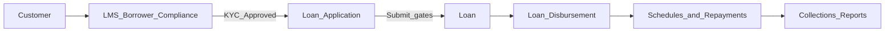

# LMS Staff Training & Operations Guide

This guide is for **desk staff** — loan officers, collectors, branch managers, and LMS admins — who use the Loan Management system day to day. It explains what the system does, how to sign in, who can do what, and step-by-step workflows.

For IT installation, VM deployment, and site configuration, see [SYSADMIN_GUIDE.md](SYSADMIN_GUIDE.md) and the technical docs in [Section 8](#8-related-documentation).

---

## Table of contents

1. [Introduction](#1-introduction)
2. [Roles and access](#2-roles-and-access)
3. [Logging in and navigating the desk](#3-logging-in-and-navigating-the-desk)
4. [Core workflows](#4-core-workflows)
5. [What borrowers see](#5-what-borrowers-see-brief)
6. [Daily operations checklist](#6-daily-operations-checklist)
7. [Troubleshooting and FAQs](#7-troubleshooting-and-faqs)
8. [Related documentation](#8-related-documentation)

---

## 1. Introduction

### What this system is

The LMS (Loan Management System) is a microfinance platform built on Frappe and ERPNext. It supports the full loan lifecycle: borrower onboarding, KYC, loan applications, disbursements, repayment tracking, collections, portfolio reporting, and RBZ fintech sandbox compliance controls.

Each organisation runs on its own **site** (separate database). Staff use the **desk** (back office). Borrowers use a separate **portal** (read-only view of their loans).

### URLs you will use

Replace `{site-url}` with your environment’s base URL (no trailing slash).

| Environment | Example `{site-url}` |
|-------------|----------------------|
| Local development | `http://lms.localhost:8000` |
| Live / production | `https://app.kesari.africa` |

| Surface | URL | Who uses it |
|---------|-----|-------------|
| **Login** | `{site-url}/login` | Staff and borrowers |
| **Staff desk (home)** | `{site-url}/app/loans` → **Loan Dashboard** | LMS staff roles |
| **Borrower portal** | `{site-url}/lms` | Customers (role Customer) |

After staff sign in, the system opens the **Loan Dashboard** (Frappe Lending). Use the left sidebar under **Lending** for loans, disbursements, and applications. **Compliance & Risk** and **Investors** are under the **Lms Saas** module. Borrowers are redirected to **My Loans** at `/lms`.

### Loan lifecycle overview

Money and records move through the stages below. Staff actions on the desk drive each step; automated jobs handle interest, delinquency classification, and payment reminders.



| Stage | Main record | Staff responsibility |
|-------|-------------|----------------------|
| Borrower identity | Customer, LMS Borrower Compliance | Create customer, complete KYC, record consent |
| Origination | Loan Application | Create and submit application; pass system checks |
| Booking | Loan | Convert approved application; submit loan |
| Funding | Loan Disbursement | Create and submit disbursement (may need second approver) |
| Servicing | Repayment schedule, Loan Repayment | Record repayments; monitor arrears |
| Oversight | Reports, LMS Incident Log, LMS Audit Event | PAR, ECL, incidents, audit review |

### Key DocTypes (records you will open)

| Name in the system | Business meaning |
|--------------------|------------------|
| **Customer** | Borrower master record |
| **LMS Borrower Compliance** | KYC, national ID, consent, credit metadata |
| **LMS Collateral** | Registered security (vehicle, property, etc.) |
| **Loan Application** | Loan request before booking |
| **Loan** | Active loan contract |
| **Loan Disbursement** | Money out to the borrower |
| **Loan Repayment** | Money in from the borrower |
| **LMS Audit Event** | Immutable log of money movements |
| **LMS Incident Log** | Operational incidents and customer complaints |
| **LMS Investor** / **LMS Investor Transaction** | Investor book (admin only) |

Standard product code seeded at install: **LMS-STD**.

---

## 2. Roles and access

### LMS roles

Roles are assigned by a **System Manager** or **LMS Admin** under **User** → Roles. Your role controls which sidebar workspaces and shortcuts you see.

| Role | Workspaces you typically see | Typical duties |
|------|------------------------------|----------------|
| **LMS Loan Officer** | Loan Management, Applications, Loans & Disbursements, Borrowers & Collateral, Reports | Onboard borrowers, KYC, applications, loans, disbursements |
| **LMS Branch Manager** | All Loan Officer workspaces plus **Collections** and **Compliance & Risk** | Oversight, collections supervision, compliance review |
| **LMS Collector** | Loan Management, **Collections**, Reports | Record repayments, run collection sheet, monitor arrears |
| **LMS Admin** | All of the above plus **Investors** | Full LMS access including investor ledger |
| **System Manager** | Full Frappe desk (all modules) | User setup, site configuration, break-glass support |

### Sidebar and module profile

LMS staff users are given the **LMS Staff** module profile. That shows **Loan Management** (Frappe Lending) and **Lms Saas** in the sidebar, and hides other ERPNext modules (Accounting, Stock, etc.) unless you also hold broader roles.

### Branch isolation (User Permissions)

Branch staff often see **only their branch’s data**. This is intentional:

1. A manager opens **User** for the staff member.
2. Under **User Permissions**, add a row: **Allow** → **Cost Center** → select the branch (Cost Center).
3. Optionally restrict **Company** the same way.

Loans, applications, and customers carry **Branch** (`custom_lms_branch`, linked to Cost Center). Lists, the desk dashboard, and reports with user permissions applied will filter to allowed branches.

If you cannot see another branch’s loans, check User Permissions before raising a defect.

### Four-eyes (maker–checker)

When the site has **four-eyes** enabled (`lms_enforce_four_eyes`), high-impact documents require a **second person** to submit:

- **Loan Disbursement**
- **Loan write-off** (if used)

The user who **created** the document cannot be the same user who **submits** it. If you see an error that another approver is required, ask a colleague with disbursement rights (often a Branch Manager) to open the document and click **Submit**.

### Customer role (portal only)

**Customer** is for borrowers, not desk staff. Do not assign Customer to loan officers unless they also need to preview the portal. Portal users need a linked **Contact** and matching email — see [Section 4a](#4a-onboard-a-borrower) and [Section 5](#5-what-borrowers-see-brief).

---

## 3. Logging in and navigating the desk

### Sign in

1. Open `{site-url}/login` in a supported browser (Chrome, Firefox, or Edge).
2. Enter your **email** (or username, if your site uses one) and **password**.
3. Click **Sign in**.
4. You land on the workspace most relevant to your role:

| Role | Landing workspace | Why |
|------|-----------------|-----|
| **LMS Admin** / System Manager | **Loan Management** | Full portfolio overview |
| **LMS Branch Manager** | **Loans & Disbursements** | Oversight of the live book |
| **LMS Loan Officer** | **Applications** | Origination pipeline is the daily focus |
| **LMS Collector** | **Collections** | Repayments and arrears are the daily focus |
| **Customer** (borrower, no desk) | **Borrower portal** (`/lms`) | Self-service loans and payments |

The sidebar shows only the workspaces your role can access. Use it to navigate between workspaces; the **Loan Dashboard** is always one click away from any workspace.

If you forget your password, use **Forgot Password?** on the login page, or ask a System Manager to reset it from the User record.

The login page also shows **sandbox risk disclosure** text for regulatory transparency. Borrowers see the same page before entering the portal.

### Help menu

Use **Help** in the top bar for LMS guides (staff training, compliance, and related docs). Links open in a new tab. Your role controls which topics appear; if something is missing, ask a System Manager.

### Desk conventions

| Action | Meaning |
|--------|---------|
| **Save** | Store a draft; no accounting impact yet for submittable documents |
| **Submit** | Finalise the document; triggers validations, GL postings (where applicable), notifications, and audit events |
| **Cancel** | Reverse a submitted document (where the DocType allows cancel) |
| **Amend** | Create a new version after submit (use sparingly; prefer cancel + correct for money docs) |

**Rule of thumb:** For Loan Application, Loan, Loan Disbursement, and Loan Repayment, training and compliance expect you to **Submit** only when the data is correct. Fixing money mistakes is done through **Cancel** and a correcting entry, not silent edits.

### CRM and prospects

Use the branded **CRM** desk home (`/app/crm`) to register leads before they become borrowers.

1. Create a **Lead** with email/mobile, **Branch**, and **Customer Consent Given** (required for outbound email and conversion).
2. Optionally send a branded acknowledgement email automatically on save when consent is recorded.
3. When ready, open the Lead and click **Convert to Borrower** (LMS menu) to create a **Customer** and start KYC in **LMS Borrower Compliance**.

### Workspace map

Use the **Lending** app sidebar for loan operations and the **Loan Dashboard** for KPIs. **Lms Saas** workspaces (below) cover LMS-specific compliance and investors.

| Workspace | Purpose | Key shortcuts |
|-----------|---------|---------------|
| **Loan Dashboard** (home) | Portfolio KPIs + charts | Lending metrics + PAR / NPA (LMS) |
| **Applications** | Origination | Loan Pipeline, **New Application** |
| **Loans & Disbursements** | Booked loans and payouts | Active Loans, Disbursements, Loan Outstanding / Loan Interest (when installed) |
| **Collections** | Repayments and arrears | Collections Ledger, PAR Snapshot, Arrears Ladder, Collector Run Sheet, Past Cashflow (when installed), Loan Repayment & Closure |
| **Borrowers & Collateral** | KYC and security | Borrower Ledger, Collateral Register, Compliance Queue |
| **Reports** | Analytics | **Lending Reports** (outstanding, cashflow, statement of account when installed), **Loan Security**, **LMS Portfolio** (PAR, arrears, collection sheet, IFRS9 ECL) |
| **Compliance & Risk** | Sandbox oversight | IFRS9 ECL, Incident & Risk Register, Audit Trail |
| **Investors** | Investor book (**LMS Admin** only) | Investor Book, Investor Transactions |

### Quick paths

| Task | Path |
|------|------|
| New loan application | Applications → **New Application**, or `{site-url}/app/loan-application/new` |
| List of active loans | Lending sidebar → **Loan**, or Applications workspace → **Active Loans** |
| Record a repayment | Collections → **Collections Ledger** → New, or Collections → **New Repayment** |
| Pending KYC | Borrowers & Collateral → **Compliance Queue** |
| Onboard a user | Borrowers & Collateral → **Onboard User**, or `{site-url}/app/lms-user-setup/new` |

### Search and lists

- Use the **search bar** (Ctrl+K / Cmd+K) to jump to a DocType by name (e.g. “Loan Repayment”).
- List views support filters (branch, status, date). Save filters you use daily.
- Open a row to see the **form**; use **Menu** → **Print** for PDFs where print formats exist.

---

## 4. Core workflows

Each workflow lists **who** should perform it, **where** to go in the desk, **steps**, what the **system does automatically**, and **common blockers**.

---

### 4a. Onboard a borrower or staff member

**Who:** LMS Loan Officer (borrowers only), LMS Branch Manager, LMS Admin  
**Where:** Borrowers & Collateral workspace → **Onboard User**, or Collections → **Onboard Borrower**

#### One-screen onboarding (recommended)

The **LMS User Setup** form replaces the old multi-step process (Customer → User → Contact → Employee). Choose a persona, fill in the details, and submit — the system creates every linked record automatically.

1. Go to **Borrowers & Collateral** → **Onboard User** (or `{site-url}/app/lms-user-setup/new`).
2. Choose **Persona**:
   - **Borrower** — creates User (role: Customer) + Customer + Contact (portal-ready).
   - **Loan Officer** — creates User (roles: LMS Loan Officer + Desk User) + Employee.
   - **Branch Manager** — creates User (roles: LMS Branch Manager + Desk User) + Employee.
   - **Collector** — creates User (roles: LMS Collector + Desk User) + Employee.
   - **Admin** — creates User (roles: LMS Admin + Desk User).
3. Enter **First Name**, **Last Name**, **Email**, and **Mobile**.
4. For staff: set **Branch** (required, pre-filled with your own branch), **Gender**, and **Date of Birth** (both optional).
5. For borrowers: enter **National ID** (required — used for KYC).
6. **Submit** — the form creates the User, Customer/Contact or Employee, applies roles, and (for desk staff) auto-assigns the **LMS Staff** module profile so the sidebar shows only Loan Management. For borrowers, the National ID is stored on the Customer so it carries over to KYC.

#### What happens automatically

- Roles are applied from the persona config (single source of truth in `install.py`).
- The `before_validate` User hook auto-applies the **LMS Staff** module profile for desk personas.
- Borrowers get a Contact linked to their Customer so portal permission resolution works.
- Staff get an Employee record so `custom_loan_officer` (Link → Employee) resolves.
- Borrowers' **National ID** is stored on the Customer record and carries over to the **LMS Borrower Compliance** record when KYC is completed — no retyping needed.
- A welcome email is sent if **Send welcome email** is checked.

#### After onboarding

- **Borrowers**: create **LMS Borrower Compliance** (KYC + consent) from the Compliance Queue, then register collateral if applicable.
- **Staff**: the new user logs in and lands on their role-specific workspace (see §3).

#### Separation of duties

- **Loan Officers** may only create **Borrower** accounts. Creating staff (Admin, Manager, Collector) requires LMS Branch Manager or LMS Admin role.

#### Common blockers

| Symptom | Cause | Fix |
|---------|-------|-----|
| "A User with email … already exists" | Duplicate email | Use a different email or edit the existing User |
| "Branch is required for staff personas" | Branch not set | Select a Branch (Cost Center) for staff personas |
| "National ID is required for the Borrower persona" | Borrower created without National ID | Enter the borrower's National ID (used for KYC) |
| "Loan Officers may only create Borrower accounts" | Officer tried to create staff | Ask a Branch Manager or Admin to create staff |
| Borrower sees empty portal | Email mismatch (rare with onboarding form) | Verify User, Contact, and Customer email match |
| Cannot submit loan application | KYC not **Approved** | Complete verification; update compliance record |
| Cannot submit loan application | Consent missing | Set consent given and date on compliance |

---

### 4b. Originate a loan

**Who:** LMS Loan Officer, LMS Branch Manager  
**Where:** Applications → **New Application**

#### Steps

1. **Create Loan Application**
   - **Applicant:** select the Customer.
   - **Loan product:** typically **LMS-STD**.
   - **Loan amount**, **rate**, **term**, and **Branch** (must match policy and user permissions).
   - Add **Collateral** child rows if the loan is secured (link pledged **LMS Collateral** and allocated value).

2. **Review and Save**  
   Confirm figures and attachments. Save if you are not ready to submit.

3. **Submit Loan Application**  
   On submit, the system runs checks (no manual step):
   - KYC **Approved** on linked compliance.
   - Sandbox limits: max loan amount, max active customers, sandbox end date (if configured).
   - **Consent** (if enforcement is on).
   - **Collateral coverage** (if site requires collateral and minimum coverage ratio).
   - **Credit bureau** score (optional; only if bureau integration is enabled on the site).

4. **Create Loan from application**
   - Open the submitted **Loan Application**.
   - Use the standard lending workflow to create a **Loan** (e.g. create Loan from application — exact button label follows ERPNext Lending).
   - Complete required fields on the **Loan** form; **Submit** the Loan.

5. **Disburse funds**
   - Loans & Disbursements → **Disbursements** → **New** **Loan Disbursement**.
   - Link to the **Loan**; enter disbursement amount and posting date.
   - **Submit** the disbursement.
   - If four-eyes is enabled, a **different user** than the document owner must submit.

#### What happens automatically

- Failed checks block submit with a clear error message.
- Successful disbursement submit creates GL entries (per product/company setup) and an **LMS Audit Event**.
- Repayment schedule is generated per loan product rules.
- Daily jobs accrue interest and update delinquency (see [4d](#4d-run-collections--arrears)).

#### Common blockers

| Symptom | Cause | Fix |
|---------|-------|-----|
| Submit blocked: KYC | Compliance not approved | Complete [4a](#4a-onboard-a-borrower) |
| Submit blocked: limit | Amount or customer cap | Branch Manager / Admin reviews site limits |
| Submit blocked: sandbox date | Sandbox window ended | Admin adjusts config or pauses origination |
| Submit blocked: collateral | Coverage below minimum | Add collateral or reduce amount |
| Submit blocked: bureau | Score below minimum | Manager override policy or adjust bureau config (IT) |
| Disbursement: four-eyes | Same user as creator | Second staff member submits |

---

### 4c. Record a repayment

**Who:** LMS Collector, LMS Branch Manager  
**Where:** Collections → **Collections Ledger** (Loan Repayment list)

#### Steps

1. Open **Collections Ledger**.
2. Click **New** **Loan Repayment**.
3. Select **Against loan** (the Loan), confirm **Applicant** and **Company**.
4. Enter **Posting date** and **Amount paid** (principal/interest split per your process and product).
5. **Save** to verify, then **Submit**.

#### What happens automatically

- GL and loan balance update per lending app rules.
- Notification **LMS Loan Repayment Received** may email/SMS the borrower (if configured).
- **LMS Audit Event** records the repayment.

#### Bulk import

For many repayments at once, managers can use **Data Import** on **Loan Repayment**. See [DATA_IMPORT.md](DATA_IMPORT.md) for column layout.

#### Common blockers

| Symptom | Cause | Fix |
|---------|-------|-----|
| Cannot find loan | Branch User Permission | Confirm loan is in your branch or request permission |
| Submit fails | Loan status / amount | Check outstanding and loan status with Loan Officer |
| Wrong balance after submit | Timing vs accrual | Ensure daily interest job has run (IT scheduler) |

---

### 4d. Run collections / arrears

**Who:** LMS Collector (daily), LMS Branch Manager (oversight)  
**Where:** Collections workspace and Reports

#### Steps

1. **Collector Run Sheet** — open each morning for the day’s collection targets (by branch/officer as configured in the report).
2. **Arrears Ladder** — review aging buckets (current, 30+, 60+, etc.).
3. **PAR Snapshot** (**Portfolio At Risk**) — portfolio-wide or branch-scoped risk view.
4. Contact borrowers per your collection policy; record outcomes in notes or **LMS Incident Log** if escalated.
5. Record payments via [4c](#4c-record-a-repayment).

#### What happens automatically

- **Daily scheduler** (must be enabled by IT):
  - Lending app: interest accrual, loan classification (DPD/NPA).
  - LMS cron: mirrors DPD to custom fields, sends **SMS** (e.g. 3 days before due) and **email** reminders.
- If SMS gateway is not configured, messages are logged only (no external send).

#### Tips

- Filter reports by **Branch** to match your User Permission.
- Use **Collection Sheet** for field visits and follow-up status where your process defines it.

---

### 4e. Compliance and oversight

**Who:** LMS Branch Manager, LMS Admin  
**Where:** Compliance & Risk workspace; Reports

#### Steps

1. **Compliance Queue** — review **LMS Borrower Compliance** records not yet Approved; assign follow-up to Loan Officers.
2. **Incident & Risk Register** — log operational incidents, cyber events, or **Customer Complaint** rows with severity and status.
3. **Audit Trail** — periodically review **LMS Audit Event** for disbursements, repayments, write-offs, and collateral changes.
4. **IFRS9 ECL Provision** report — provisioning view for sandbox reporting and finance oversight.
5. **Weekly sandbox KPI** — IT or Admin runs the compliance report (see below). Branch Managers should know what metrics are included for RBZ submissions.

#### Weekly sandbox report (for managers / IT)

IT runs this on the server; managers receive the output for RBZ weekly progress (Annex 5.1):

```bash
bench --site {site-name} execute lms_saas.api.compliance.get_sandbox_report
```

Default period: last **7 days**. The report includes:

| Metric | Description |
|--------|-------------|
| `volunteer_customers` | Distinct borrowers with active/disbursed loans |
| `transactions.disbursements_*` | Count and value of disbursements in period |
| `transactions.repayments_*` | Count and value of repayments in period |
| `incidents_open` | Open or investigating incidents |
| `complaints` | Customer complaints in period |
| `incident_log` | Detail list of incidents |
| `audit_events` | Count of audit events in period |

See [COMPLIANCE.md](COMPLIANCE.md) for how controls map to RBZ sandbox guidelines.

---

### 4f. Investor management

**Who:** LMS Admin only  
**Where:** Investors workspace

#### Steps

1. **Investor Book** — maintain **LMS Investor** records (name, terms, linked accounts as defined on the form).
2. **Investor Transactions** — create **LMS Investor Transaction** for subscriptions, withdrawals, or income allocations per your policy.
3. **Submit** the transaction — system posts the related **Journal Entry** and writes an **LMS Audit Event**.

Collectors and Loan Officers do not have access to the Investors workspace.

---

## 5. What borrowers see (brief)

Staff should know this when helping borrowers on the phone or at the branch.

| Item | Detail |
|------|--------|
| **URL** | `{site-url}/lms` (after login at `{site-url}/login`) |
| **Home screen** | Portfolio Dashboard — summary, risk mix, upcoming dues, loan cards |
| **Loan detail** | `{site-url}/lms/loan?name={loan_id}` — schedule, payment history |
| **Statement** | Download PDF from loan detail (loan statement print format) |

**Borrowers cannot (without staff / config):**

- See other customers’ data.
- Submit applications if consent is not recorded on **LMS Borrower Compliance**.

**Borrowers can (when enabled):**

- View loans and balances at `{site-url}/lms`.
- **Apply for a loan** at `{site-url}/lms/apply` (draft application for desk review).
- **Upload KYC documents** during apply (file URL / desk-assisted upload).
- **Initiate online repayment** at `{site-url}/lms/pay` when `lms_payments_enabled` is set and providers are configured.
- Download statement PDF from loan detail.

**Collectors** (LMS Collector role) use `{site-url}/lms/collect` for the field collection run sheet (offline-capable PWA).

**Group loans:** link **Lending Group** on Loan Application when using **LMS Lending Group** records.

If a borrower reports “I see nothing,” verify [Section 4a step 3](#4a-onboard-a-borrower) (User, Contact, Customer, same email).

---

## 6. Daily operations checklist

Use this as a branch manager’s rhythm. Adjust frequency to your operating model.

| Task | Suggested frequency | Where in desk |
|------|---------------------|---------------|
| Review **Loan Pipeline** (new / in-progress applications) | Daily | Applications |
| Process pending **Disbursements** | As needed | Loans & Disbursements |
| Run **Collector Run Sheet** | Daily | Collections |
| Record **Loan Repayments** | Daily | Collections → Collections Ledger |
| Check **Desk ToDos** from overdue loans (DPD 7+) | Daily | ToDo list / notifications |
| Review **morning digest** email (if enabled) | Daily | Inbox — portfolio, PAR, KYC pending |
| Review **Compliance Queue** (KYC pending) | Weekly (also in digest when enabled) | Borrowers & Collateral |
| Scan **PAR Snapshot** / **Arrears Ladder** | Weekly (or daily in high-arrears periods) | Collections / Reports |
| Log **incidents** and **complaints** | As they occur | Compliance & Risk |
| Review **Audit Trail** and **LMS Notification Log** sample | Weekly | Compliance & Risk |
| Review **Weekly Sandbox KPI** report / email | Weekly | Compliance & Risk → Weekly Sandbox KPI |

**Scheduler:** Interest accrual, classification, DPD mirror, and automated collections/digest/KPI jobs depend on the site scheduler. If reminders or digests stop company-wide, escalate to IT — see [SETUP.md](SETUP.md) and [SYSADMIN_GUIDE.md §9](SYSADMIN_GUIDE.md).

**Automation (IT-enabled):** Collections escalation (T-N, due today, DPD milestones), morning digest, and weekly RBZ KPI pack are **off by default**. When enabled, borrowers without recorded consent are skipped when `lms_require_consent` is on. SMS gateway failures create **LMS Incident Log** (Technical) entries for IT follow-up.

---

## 7. Troubleshooting and FAQs

### “I can’t submit the loan application”

Check in order:

1. **LMS Borrower Compliance** for this Customer — KYC status **Approved**?
2. **Consent given** and **Consent date** set (if your sandbox enforces consent)?
3. Loan **amount** within site maximum?
4. **Collateral** rows and coverage (if secured lending rules are on)?
5. **Sandbox end date** — has the pilot window expired?

Read the red error message on submit; it states which gate failed.

### “Disbursement needs another approver”

**Four-eyes** is on. Log out is not required — a colleague opens the same **Loan Disbursement** and clicks **Submit**. The submitter must not be the user who created the document.

### “I don’t see other branches’ loans”

**User Permissions** on **Cost Center** restrict your account. This is normal for branch staff. Managers with multi-branch responsibility need permissions for each branch or a role without branch restriction (policy decision).

### “Reports are empty”

- Confirm loans exist for your branch and are **Submitted**.
- Check report filters (branch, date range, company).
- Demo data may not be loaded on your site — ask IT if training on a fresh site.

### “Borrower can’t see loans on the portal”

- User has role **Customer** only (plus portal access).
- **Contact** is linked to **Customer**; emails match **User** and **Customer**.
- Loans exist and are submitted for that applicant.

### “Balances on portal look wrong”

Escalate to **LMS Admin** or **System Manager** with the loan ID. Do not edit submitted GL-related records without following cancel/correct procedure.

### “SMS / email reminders not sent”

- IT: scheduler enabled?
- IT: **SMS Settings** / **Email Account** configured?
- If gateway unset, LMS logs messages only.

### “Page lms-notification-log not found”

This list is for **oversight roles** (LMS Admin, LMS Branch Manager, LMS Collector). **LMS Loan Officers** do not have access — Frappe shows “Not found” instead of a permission error.

**How to open it (if you have access):**

1. **Compliance & Risk** workspace → **Notification Log** shortcut, or
2. Awesomebar: type `LMS Notification Log` → open List.

Rows are created automatically when collections SMS/email runs (when `lms_collections_escalation_enabled` is on). An empty list before automation is enabled is normal.

### Who to escalate to

| Issue type | Contact |
|------------|---------|
| Access, roles, passwords | System Manager |
| LMS process, four-eyes, compliance | LMS Admin / Branch Manager |
| Site down, backups, scheduler | IT / System Manager |
| Regulatory reporting content | Branch Manager + compliance lead |

---

## 8. Related documentation

| Document | Audience | Contents |
|----------|----------|----------|
| [SYSADMIN_GUIDE.md](SYSADMIN_GUIDE.md) | IT / System Manager | Full admin: install, site_config, GL, backups, compliance, troubleshooting |
| [SETUP.md](SETUP.md) | IT / developers | Quick install reference, blueprint, verification |
| [STAGING.md](STAGING.md) | IT | Live VM deploy for `app.kesari.africa` |
| [COMPLIANCE.md](COMPLIANCE.md) | Compliance / IT | RBZ sandbox control mapping |
| [DATA_IMPORT.md](DATA_IMPORT.md) | Managers | Bulk Loan Repayment import |
| [BACKUP.md](BACKUP.md) | IT | Backup and restore |
| [BRANDING.md](BRANDING.md) | IT / marketing | Desk and portal themes |

---

*Document version: aligns with Frappe Lending Loan Dashboard and LMS_NAV_SPEC compliance workspaces in `install.py`.*
