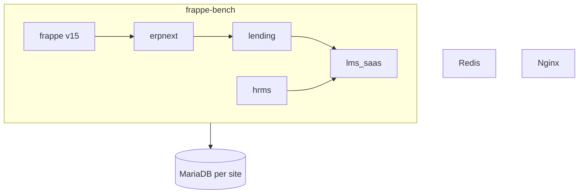

# LMS System Administrator Guide

This guide is for **System Managers**, **LMS Admins**, and **IT operators** who install, configure, secure, deploy, and maintain the Loan Management System. It consolidates operational knowledge from the LMS codebase and companion docs.

**Staff desk training:** [STAFF_GUIDE.md](STAFF_GUIDE.md)  
**Quick install reference:** [SETUP.md](SETUP.md)  
**Pilot VM deployment:** [STAGING.md](STAGING.md)

---

## Table of contents

1. [Administrator responsibilities](#1-administrator-responsibilities)
2. [Architecture](#2-architecture)
3. [Repository and bench layout](#3-repository-and-bench-layout)
4. [Install and upgrade](#4-install-and-upgrade)
5. [Site configuration reference](#5-site-configuration-reference)
6. [Company, branches, and GL](#6-company-branches-and-gl)
7. [Users, roles, and access control](#7-users-roles-and-access-control)
8. [Integrations](#8-integrations)
9. [Scheduler and background jobs](#9-scheduler-and-background-jobs)
10. [Compliance controls](#10-compliance-controls)
11. [Backup, restore, and disaster recovery](#11-backup-restore-and-disaster-recovery)
12. [Deploy updates](#12-deploy-updates)
13. [Verification and health checks](#13-verification-and-health-checks)
14. [Monitoring and troubleshooting](#14-monitoring-and-troubleshooting)
15. [Multi-tenant and performance](#15-multi-tenant-and-performance)
16. [Related documentation](#16-related-documentation)

---

## 1. Administrator responsibilities

| Area | Your tasks |
|------|------------|
| **Platform** | Bench, MariaDB, Redis, Nginx, Supervisor, SSL, OS patches |
| **Applications** | Install/migrate `erpnext`, `lending`, `hrms`, `lms_saas` — never patch Frappe/ERPNext core |
| **Site config** | `site_config.json` — compliance limits, bureau, GL overrides, theme |
| **Security** | Secrets in config only; RBAC; backups; least-privilege users |
| **Operations** | Enable scheduler; monitor jobs; restore drills |
| **Compliance** | Sandbox limits, weekly KPI export, audit/incident readiness |
| **Support** | Portal user linkage; escalate to developers for app bugs |

Replace `{site}` with your Frappe site name (e.g. `lms.localhost`, `app.kesari.africa`).

| Environment | Example `{site-url}` |
|-------------|----------------------|
| Local | `http://lms.localhost:8000` |
| Live / production | `https://app.kesari.africa` |

---

## 2. Architecture

### Stack



| App | Role | Modify in this project? |
|-----|------|------------------------|
| **frappe** | Framework, desk, scheduler, users | **No** — use hooks and config |
| **erpnext** | Company, Customer, GL, accounts | **No** |
| **lending** | Loan, Loan Application, schedules, accrual | **No** — install via bench |
| **hrms** | Employee (loan officer link) | **No** |
| **lms_saas** | LMS customizations, portal, compliance, reports | **Yes** — `apps/lms_saas/` |

**Install order on a new site:**

```text
erpnext → lending → hrms → lms_saas
```

Then: `bench migrate` → `bench build --app lms_saas` → `lms_saas.install.after_install`.

### Surfaces

| Surface | URL | Notes |
|---------|-----|-------|
| Login | `{site-url}/login` | Branded; sandbox risk disclosure |
| Staff desk | `{site-url}/app/loans` (Loan Dashboard default) | Lending + Lms Saas workspaces |
| Borrower portal | `{site-url}/lms` | Role **Customer** only |
| REST API | `{site-url}/api` | Standard Frappe API |

### What `after_install` provisions

Running `lms_saas.install.after_install` (also on `after_migrate`) seeds:

- Branches as **Cost Centers** and loan product **LMS-STD**
- LMS roles and DocType permissions
- **Loan Management** workspace tree (from `LMS_NAV_SPEC`)
- **LMS Staff** module profile (sidebar lockdown for desk staff)
- Dashboard number cards/charts, print formats, notifications
- Portal menu, website branding hooks, custom fields (fixtures)

Re-run after app upgrades:

```bash
bench --site {site} migrate
bench build --app lms_saas
bench --site {site} execute lms_saas.install.after_install
bench --site {site} clear-cache
```

### Automation hooks (`hooks.py`)

| Trigger | Handler | Purpose |
|---------|---------|---------|
| `User.before_validate` | `api.staff.apply_lms_module_profile` | Auto-assign LMS Staff module profile |
| `Loan Application.before_submit` | compliance, collateral, underwriting | Sandbox limits, coverage, KYC/bureau |
| `Loan Disbursement.before_submit` | `enforce_four_eyes` | Maker–checker |
| `Loan Write Off.before_submit` | `enforce_four_eyes` | Maker–checker |
| Money docs `on_submit` / `on_cancel` | `record_money_event` | **LMS Audit Event** trail |
| `LMS Investor Transaction` | investors GL + audit | Journal Entry on submit |
| Daily scheduler | `tasks.run_daily_loan_cron` | DPD mirror, SMS/email reminders |

---

## 3. Repository and bench layout

### Source of truth

| Path | Purpose |
|------|---------|
| `apps/lms_saas/` | LMS app (commit changes here) |
| `frappe-bench/apps/lms_saas` | Symlink → `../../apps/lms_saas` |

Verify symlink:

```bash
readlink -f frappe-bench/apps/lms_saas
# should resolve to .../erp-loan-microfin/apps/lms_saas
```

**Rule:** Edit only `apps/lms_saas`. Do not fork or patch `frappe-bench/apps/frappe` or `erpnext`.

### Key paths on the server

| Path | Contents |
|------|----------|
| `frappe-bench/sites/{site}/site_config.json` | Site secrets and LMS flags |
| `frappe-bench/sites/{site}/private/backups/` | SQL + files backups |
| `frappe-bench/logs/` | `web.error.log`, `worker.error.log` |
| `frappe-bench/apps/lms_saas/` | Deployed app code |

`site_config.json` is **not** in Git. Manage per environment on the server.

---

## 4. Install and upgrade

### Local development (new bench)

Prerequisites: Python 3.10+, MariaDB (utf8mb4), Redis, Node 18, Yarn.

```bash
cd frappe-bench
export PATH="$HOME/.local/bin:$PATH"

# If apps missing:
bench get-app erpnext --branch version-15
bench get-app lending
bench get-app hrms --branch version-15
# lms_saas: symlink or bench get-app from repo path

bench new-site lms.localhost --admin-password 'CHANGE_ME'
bench --site lms.localhost install-app erpnext lending hrms lms_saas
bench --site lms.localhost migrate
bench build --app lms_saas
bench --site lms.localhost execute lms_saas.install.after_install
bench --site lms.localhost enable-scheduler
bench --site lms.localhost clear-cache
```

Link app from this repo:

```bash
ln -sf ../../apps/lms_saas frappe-bench/apps/lms_saas
```

### Production / pilot VM

Full steps: DNS, MariaDB utf8mb4, `bench init`, SSL, production setup, pilot `site_config` — see [STAGING.md](STAGING.md).

Summary after site creation:

```bash
bench --site {site} install-app erpnext lending hrms lms_saas
bench --site {site} migrate
bench build --app lms_saas
bench --site {site} execute lms_saas.install.after_install
bench --site {site} enable-scheduler
sudo bench setup production frappe --yes
# Certbot for HTTPS
```

Set `developer_mode: 0` on production sites.

### Demo and test data

| Command | Use |
|---------|-----|
| `lms_saas.setup.seed_demo.run` | Single demo loan path |
| `lms_saas.setup.seed_demo.run_bulk` | Multi-branch PAR/arrears exercise data |

```bash
bench --site {site} execute lms_saas.setup.seed_demo.run
bench --site {site} execute lms_saas.setup.seed_demo.run_bulk --kwargs '{"count":16}'
```

**Non-production only.** After bulk seed, run lending interest accrual once if repayments behave incorrectly:

```bash
bench --site {site} execute lending.loan_management.doctype.process_loan_interest_accrual.process_loan_interest_accrual.process_loan_interest_accrual_for_term_loans
```

### Copy site to another environment

1. On source: `bench --site {source} backup --with-files`
2. Copy `.sql.gz` and `*-files.tar` to target server
3. On target: `bench --site {target} restore ...` then `migrate` and `clear-cache`
4. Reset admin password if needed: `bench --site {target} set-admin-password '...'`

Details: [STAGING.md §7](STAGING.md), [BACKUP.md](BACKUP.md).

---

## 5. Site configuration reference

Edit `frappe-bench/sites/{site}/site_config.json`. Merge keys; keep existing `db_name`, `db_password`, etc.

After changes:

```bash
bench --site {site} clear-cache
```

### LMS configuration keys

| Key | Type | Default | Purpose |
|-----|------|---------|---------|
| `lms_theme` | string | `default` | UI theme: `default`, `midnight` — see [BRANDING.md](BRANDING.md) |
| `lms_enforce_four_eyes` | bool | `false` | Disbursement/write-off: submitter ≠ owner |
| `lms_require_consent` | bool | `false` | Block origination without borrower consent |
| `lms_max_loan_amount` | number | — | Per-loan cap on application submit |
| `lms_max_active_customers` | number | — | Cap distinct active borrowers |
| `lms_sandbox_end_date` | date | — | Block origination after date (RBZ window) |
| `lms_require_collateral` | bool | `false` | Block application submit with no collateral |
| `lms_min_collateral_coverage` | number | — | Min NRV / loan amount ratio (e.g. `1.25`) |
| `lms_credit_bureau_enabled` | bool | `false` | Call external bureau on application submit |
| `lms_credit_bureau_url` | string | — | POST endpoint; body `{ "id_number": "..." }` |
| `lms_credit_bureau_min_score` | int | `600` | Reject if score below minimum |
| `lms_credit_bureau_block_on_error` | bool | `false` | If `false`, bureau outage is fail-open |
| `lms_credit_bureau_timeout` | int | `10` | HTTP timeout seconds |
| `lms_aml_enabled` | bool | `false` | Call external AML/CFT provider on compliance create + origination |
| `lms_aml_url` | string | — | POST endpoint; body `{ "id_number", "name", "customer" }` |
| `lms_aml_block_on_error` | bool | `false` | If `false`, AML outage is fail-open |
| `lms_aml_require_clear` | bool | `true` | Block origination unless `aml_status` is Clear |
| `lms_aml_timeout` | int | `15` | HTTP timeout seconds |
| `lms_payments_enabled` | bool | `false` | Enable portal/desk online repayments |
| `lms_ecocash_api_url` | string | — | EcoCash payment API base URL |
| `lms_ecocash_webhook_secret` | string | — | HMAC secret for inbound webhooks |
| `lms_onemoney_api_url` | string | — | OneMoney payment API base URL |
| `lms_onemoney_webhook_secret` | string | — | OneMoney webhook HMAC secret |
| `lms_bank_account_name` | string | — | Bank transfer display name |
| `lms_bank_account_number` | string | — | Bank transfer account number |
| `lms_bank_name` | string | — | Bank name for transfer instructions |
| `lms_bank_transfer_ref_prefix` | string | `LMS` | Reference prefix for bank transfers |
| `lms_loan_account` | string | auto | GL override: loan receivable account name |
| `lms_interest_income_account` | string | auto | GL override: interest income |
| `lms_disbursement_account` | string | auto | GL override: bank/cash for disbursements |
| `lms_collections_escalation_enabled` | bool | `false` | Full collections SMS/email + DPD milestones + collector ToDos |
| `lms_collections_dpd_milestones` | list | `[1, 7, 30]` | DPD days that trigger escalation messages |
| `lms_collections_remind_days_before` | int | `3` | T-N payment reminder (days before due) |
| `lms_digest_enabled` | bool | `false` | Daily morning digest email to branch managers |
| `lms_digest_recipients` | string | — | Comma-separated emails (else LMS Branch Manager users) |
| `lms_weekly_kpi_enabled` | bool | `false` | Weekly RBZ sandbox KPI email with JSON attachment |
| `lms_compliance_report_recipients` | string | — | Comma-separated emails for weekly KPI pack |
| `lms_kyc_pending_alert_days` | int | `3` | KYC pending rows included in morning digest |
| `lms_risk_disclosure` | string | — | Borrower portal risk disclosure strip text |

**KYC Approved** is always enforced in code; it is not toggled via `site_config`.

### Example: pilot sandbox site

```json
{
  "lms_enforce_four_eyes": true,
  "lms_require_consent": true,
  "lms_max_loan_amount": 50000,
  "lms_max_active_customers": 100,
  "lms_sandbox_end_date": "2027-02-28",
  "lms_credit_bureau_enabled": false,
  "lms_theme": "default",
  "developer_mode": 0
}
```

### Example: secured lending

```json
{
  "lms_require_collateral": true,
  "lms_min_collateral_coverage": 1.25
}
```

### Secrets policy

- **Never** commit API keys, bureau URLs with credentials, or production passwords to Git.
- Use `site_config.json`, environment variables, or Frappe **Email Account** / **SMS Settings** on the server.
- Restrict file permissions: `chmod 600 sites/{site}/site_config.json`.

---

## 6. Company, branches, and GL

### Company

Ensure one **Company** is set in **Global Defaults** (seeded at install). All loans and GL postings use this company.

### Branches

Branches are **Cost Centers** (seeded names such as branch codes). Custom field **`custom_lms_branch`** on Customer, Loan Application, and Loan links records to Cost Center.

Staff branch isolation: **User Permission** → Allow → Cost Center. See [STAFF_GUIDE.md §2](STAFF_GUIDE.md).

### Loan product LMS-STD

Created by `install.py`. Account mapping runs in `_sync_loan_product_accounts()`:

1. Explicit `lms_*_account` keys in `site_config` (recommended for production)
2. Else heuristic lookup (Receivable, Income, Bank/Cash)

If mapping fails, check **Error Log** for `LMS GL mapping incomplete` and set overrides:

```json
{
  "lms_loan_account": "Debtors - {Company Abbr}",
  "lms_interest_income_account": "Interest Income - {Company Abbr}",
  "lms_disbursement_account": "Bank - {Company Abbr}"
}
```

Then:

```bash
bench --site {site} execute lms_saas.install.after_install
```

### HRMS / loan officer

**HRMS** is required (`hooks.py` `required_apps`). Link loans to officers via **`custom_loan_officer`** (Employee). Ensure employees exist for officer-based reporting.

---

## 7. Users, roles, and access control

### LMS desk roles (seeded)

| Role | Assign to |
|------|-----------|
| **LMS Admin** | Platform lead; investor workspace |
| **LMS Branch Manager** | Branch oversight, compliance workspace |
| **LMS Loan Officer** | Origination, KYC, disbursements |
| **LMS Collector** | Repayments, collection reports |

Also assign **Desk User** so staff can access the desk.

**System Manager** — full Frappe access; use sparingly.

### Module profile automation

When a User with any LMS desk role is saved, `apply_lms_module_profile` assigns the **LMS Staff** module profile so the sidebar shows only the Loan Management app tree.

### Portal users (borrowers)

| Step | Action |
|------|--------|
| 1 | **Customer** with email |
| 2 | **User** — same email, roles: **Customer** (not Desk User unless dual-role) |
| 3 | **Contact** linked to Customer — email matches User |
| 4 | **LMS Borrower Compliance** — KYC Approved, consent if enforced |

Test: log in as borrower → `{site-url}/lms`.

### Password and access maintenance

```bash
bench --site {site} set-admin-password 'NEW_PASSWORD'
```

Desk: **User** → reset password, disable user, review **Activity Log** / **Access Log** (if enabled).

### RBAC audit (demo users)

`verify_access` expects demo users (create manually if running audit):

| Role | Demo email |
|------|------------|
| LMS Admin | `demo.lms.admin@example.com` |
| LMS Branch Manager | `demo.lms.branch@example.com` |
| LMS Loan Officer | `demo.lms.officer@example.com` |
| LMS Collector | `demo.lms.collector@example.com` |

```bash
bench --site {site} execute lms_saas.setup.verify_access.run_all
```

---

## 8. Integrations

### Outgoing email

1. Desk → **Email Account** → outgoing SMTP
2. Test from **Email Account** or send a notification
3. Repayment notification: **LMS Loan Repayment Received** (seeded)

### SMS gateway

1. Desk → **SMS Settings**
2. Set **`sms_gateway_url`** — HTTP POST JSON: `{ "to": "...", "message": "..." }`
3. If unset, `tasks.py` logs messages only (no external send)

Do not store gateway credentials in `lms_saas` source code.

### Credit bureau

Enable only when a sandbox-safe endpoint exists. See [§5](#5-site-configuration-reference).

- Request: `POST` with `{"id_number": "<national_id>"}`
- Response JSON: `score`, optional `dti`
- **Fail-open** by default (`lms_credit_bureau_block_on_error: false`)

Pilot checklist: keep `lms_credit_bureau_enabled: false` unless using a dedicated sandbox API ([STAGING.md](STAGING.md)).

### Branded UI

Theme via `lms_theme` in `site_config`. After CSS/JS changes:

```bash
bench build --app lms_saas
bench --site {site} clear-cache
```

See [BRANDING.md](BRANDING.md).

---

## 9. Scheduler and background jobs

### Enable scheduler

```bash
bench --site {site} enable-scheduler
bench --site {site} doctor
```

If disabled, interest accrual, NPA classification, and payment reminders stop.

### Job ownership

| Job | App | Schedule | Function |
|-----|-----|----------|----------|
| Term loan interest accrual | lending | `daily_long` | `process_loan_interest_accrual_for_term_loans` |
| Loan classification (DPD/NPA) | lending | `daily_long` | `create_process_loan_classification` |
| LMS daily cron | lms_saas | `daily` | `lms_saas.tasks.run_daily_loan_cron` |
| LMS weekly KPI pack | lms_saas | `weekly` | `lms_saas.tasks.send_weekly_sandbox_kpi_pack` |

**LMS cron** mirrors DPD to `custom_days_past_due` / `custom_asset_classification`, then runs config-gated collections escalation and morning digest. When `lms_collections_escalation_enabled` is off, only the legacy T-N reminder path runs. It does **not** post GL (avoids failing on account misconfiguration).

### Enable workflow automation (pilot)

Merge into `site_config.json` as needed:

```json
{
  "lms_collections_escalation_enabled": true,
  "lms_collections_dpd_milestones": [1, 7, 30],
  "lms_collections_remind_days_before": 3,
  "lms_digest_enabled": true,
  "lms_digest_recipients": "manager@example.com",
  "lms_weekly_kpi_enabled": true,
  "lms_compliance_report_recipients": "compliance@example.com",
  "lms_kyc_pending_alert_days": 3
}
```

Then `bench --site {site} clear-cache`. Verify **LMS Notification Log** idempotency and **LMS Sandbox Weekly KPI** report after `bench migrate`.

**Lending** jobs post accrual and NPA suspense — require correct loan product accounts.

### Manual job run (debug)

```bash
bench --site {site} execute lending.loan_management.doctype.process_loan_interest_accrual.process_loan_interest_accrual.process_loan_interest_accrual_for_term_loans
bench --site {site} execute lms_saas.tasks.run_daily_loan_cron
```

### Production cron for backups

Host crontab (not Frappe scheduler) — example:

```cron
0 2 * * * cd /home/frappe/frappe-bench && /home/frappe/.local/bin/bench --site {site} backup --with-files >> /home/frappe/backup.log 2>&1
```

Or use [scripts/backup-site.sh](../scripts/backup-site.sh):

```bash
./apps/lms_saas/scripts/backup-site.sh {site}
```

---

## 10. Compliance controls

RBZ fintech sandbox mapping: [COMPLIANCE.md](COMPLIANCE.md). Regulatory PDF: `docs/compliance/RBZ-Fintech-Regulatory-Sandbox-Guidelines-2021.pdf`.

### Administrator checklist (pilot)

- [ ] `lms_require_consent`, limits, and `lms_sandbox_end_date` set in `site_config`
- [ ] `lms_enforce_four_eyes` enabled for production-like pilot
- [ ] Scheduler enabled
- [ ] Credit bureau disabled or sandbox-only endpoint
- [ ] No crypto/CBDC features (out of scope; prohibited)
- [ ] Daily backups scheduled; restore tested
- [ ] `verify_spec.run_all_checks` passes
- [ ] Weekly KPI process defined

### Weekly sandbox KPI export

```bash
bench --site {site} execute lms_saas.api.compliance.get_sandbox_report
```

Optional period (days):

```bash
bench --site {site} execute lms_saas.api.compliance.get_sandbox_report --kwargs '{"days": 7}'
```

Returns JSON:

| Field | Meaning |
|-------|---------|
| `volunteer_customers` | Distinct applicants with active/disbursed loans |
| `transactions.disbursements_*` | Count and value in period |
| `transactions.repayments_*` | Count and value in period |
| `incidents_open` | Open/investigating **LMS Incident Log** rows |
| `complaints` | Customer complaints in period |
| `audit_events` | **LMS Audit Event** count in period |

Schedule via cron and archive output for RBZ submissions.

### Audit and incidents

- **LMS Audit Event** — auto-created on submit/cancel of Loan, Disbursement, Repayment, Investor Transaction, Collateral
- **LMS Incident Log** — manual; staff log complaints and operational incidents
- Frappe **Version** history — standard document versioning

### Collateral (optional enforcement)

When `lms_require_collateral` is true, Loan Application submit requires pledged collateral and minimum coverage ratio. Off by default for dev seeding.

---

## 11. Backup, restore, and disaster recovery

### Manual backup

```bash
cd frappe-bench
export PATH="$HOME/.local/bin:$PATH"
bench --site {site} backup --with-files
```

Output: `sites/{site}/private/backups/` (`.sql.gz` + files archive).

### Restore

```bash
bench --site {site} restore /path/to/database.sql.gz
bench --site {site} restore --with-public-files /path/to/files.tar
bench --site {site} migrate
bench --site {site} clear-cache
```

### Off-site copy

Copy backups to S3 or another region after each run. Example:

```bash
aws s3 cp sites/{site}/private/backups/ s3://your-bucket/lms-backups/ --recursive
```

### Production checklist

| Item | Frequency |
|------|-----------|
| `bench backup --with-files` | Daily |
| Restore drill | Quarterly |
| Encrypt backups at rest | Always |
| Restrict `private/backups` permissions | Always |

Full detail: [BACKUP.md](BACKUP.md).

---

## 12. Deploy updates

When `lms_saas` (or dependencies) change:

```bash
cd frappe-bench
# Pull/rsync app code to apps/lms_saas

export PATH="$HOME/.local/bin:$PATH"
bench --site {site} migrate
bench build --app lms_saas
bench --site {site} execute lms_saas.install.after_install
bench --site {site} clear-cache
```

Production (Supervisor):

```bash
sudo supervisorctl restart all
```

### Pre-deploy

```bash
bench --site {site} backup --with-files
bench --site {site} run-tests --app lms_saas   # optional
```

### Post-deploy verification

```bash
bench --site {site} execute lms_saas.setup.verify_spec.run_all_checks
```

Hard-refresh browsers after UI deploy (Ctrl+Shift+R).

---

## 13. Verification and health checks

### Full specification check

```bash
bench --site {site} execute lms_saas.setup.verify_spec.run_all_checks
```

Inspect JSON: top-level `"ok": true`. Failed checks include hints (e.g. scheduler disabled).

| Check | Validates |
|-------|-----------|
| `apps` | erpnext, lending, hrms, lms_saas installed |
| `custom_fields` | Branch, DPD, collateral fields |
| `reports` | PAR, Arrears, Collection Sheet, IFRS9 |
| `roles` | LMS roles exist |
| `workspace` | Lms Saas compliance workspaces |
| `loan_dashboard` | Loan Dashboard hybrid KPIs |
| `desk_lockdown` | LMS Staff module profile |
| `scheduler` | Scheduler enabled |
| `lending_jobs` | Lending scheduled methods registered |
| `compliance` | Audit/incident doctypes, sandbox API |
| `collateral` | Collateral doctypes and API |
| `role_screen_access` | Workspace sidebar per demo role |
| `portal_api` | Borrower API smoke |
| `demo_loan` | Optional demo data presence |

### Permission smoke (PAR report)

```bash
bench --site {site} execute lms_saas.setup.check_perms.run
```

### Site doctor

```bash
bench --site {site} doctor
bench --site {site} list-apps
```

### Pre-pilot checklist (production)

See [STAGING.md §12](STAGING.md). Key items:

- HTTPS valid
- Scheduler on
- `verify_spec` OK
- Desk at `/app/loans` (Loan Dashboard), portal at `/lms`
- Sandbox `site_config` applied
- Backups cron active
- Administrator password in password manager

---

## 14. Monitoring and troubleshooting

### Log files

```bash
tail -f frappe-bench/logs/web.error.log
tail -f frappe-bench/logs/worker.error.log
sudo tail -f /var/log/nginx/error.log
```

Desk: **Error Log** for `LMS GL`, `LMS Credit Bureau API Failure`, etc.

### Common symptoms

| Symptom | Likely cause | Action |
|---------|--------------|--------|
| 502 Bad Gateway | Supervisor/nginx down | `sudo supervisorctl restart all` |
| CSS/JS broken | Assets not built | `bench build --app lms_saas` + `clear-cache` |
| Scheduler idle | Disabled | `bench --site {site} enable-scheduler` |
| Interest/repayment wrong | Accrual not run | Run lending accrual job; check product accounts |
| Origination blocked | Compliance config | Review `site_config` limits, consent, sandbox date |
| Bureau errors | Endpoint down | Disable bureau or set fail-open |
| Portal empty for user | Contact/email mismatch | Align Customer, User, Contact |
| Negative portal balance | Stale code/data | Migrate; deploy latest `lms_saas` |
| GL submit fails | Accounts missing | Set `lms_*_account` overrides; `after_install` |

### MariaDB charset

Frappe requires utf8mb4. On Ubuntu, configure MariaDB before `bench new-site` — see [STAGING.md §2](STAGING.md).

### SSL renewal

Certbot systemd timer on production VMs. Verify: `sudo certbot renew --dry-run`.

### Escalation

| Issue | Escalate to |
|-------|-------------|
| Infrastructure, SSL, DB | Hosting / DevOps |
| App bug, hook behavior | Development team (`apps/lms_saas`) |
| Core Frappe/ERPNext | Prefer config/hooks; avoid core patches |
| Regulatory interpretation | Compliance officer |

---

## 15. Multi-tenant and performance

### Tenancy model

- **One Frappe site = one tenant** (isolated database)
- Shared bench code; data never crosses sites
- New tenant: `bench new-site` + full app install

### Branch isolation within a site

**User Permissions** on Cost Center (and optionally Company). Reports with `apply_user_permissions: 1` respect scope.

### Performance notes

Indexed custom fields: `custom_days_past_due`, `custom_lms_branch`, `custom_loan_officer`.

For large portfolios:

- Prefer report/query aggregation over loading full loan lists in custom code
- Monitor MariaDB slow query log
- Scale VM RAM/CPU before single-site sharding

### Data import at scale

Bulk **Loan Repayment**: [DATA_IMPORT.md](DATA_IMPORT.md). Run in batches; validate against test site first.

---

## 16. Related documentation

| Document | Contents |
|----------|----------|
| [SETUP.md](SETUP.md) | Condensed install, blueprint, cron summary |
| [STAGING.md](STAGING.md) | VM pilot deploy, DNS, SSL, restore, checklist |
| [STAFF_GUIDE.md](STAFF_GUIDE.md) | End-user desk training |
| [COMPLIANCE.md](COMPLIANCE.md) | RBZ control mapping |
| [BRANDING.md](BRANDING.md) | Themes and UI assets |
| [BACKUP.md](BACKUP.md) | Backup/restore/S3 |
| [DATA_IMPORT.md](DATA_IMPORT.md) | Repayment bulk import |

### Bench command quick reference

```bash
bench start                                          # dev server
bench --site {site} migrate
bench build --app lms_saas
bench --site {site} execute lms_saas.install.after_install
bench --site {site} enable-scheduler
bench --site {site} clear-cache
bench --site {site} backup --with-files
bench --site {site} execute lms_saas.setup.verify_spec.run_all_checks
bench --site {site} execute lms_saas.api.compliance.get_sandbox_report
bench --site {site} doctor
```

---

*Aligns with `lms_saas` hooks, `install.py`, and verification scripts in `apps/lms_saas/lms_saas/`.*

## 17. Portal Addons

The LMS portal supports admin-toggleable addons that extend the borrower
and staff portals with new functionality. Addons are disabled by default
and can be enabled from the **LMS Addon Settings** desk page (or
`site_config.json`).

### 17.1 Available addons

| Key | Label | Personas | Purpose |
|-----|-------|----------|---------|
| `announcements` | Announcements | All staff, Borrower | Internal board with acknowledgement |
| `task_management` | Task Management | All staff | Kanban tasks linked to loans/projects |
| `document_center` | Document Center | All staff, Borrower | Centralised documents, expiry tracking |
| `helpdesk` | Support / Helpdesk | All staff, Borrower | Ticket system, complaint escalation |
| `hr_management` | HR Management | Manager, Admin | Leave, attendance, expenses, shifts |
| `branch_analytics` | Branch Analytics | Manager, Admin | Cross-branch KPI comparison |
| `regulatory_hub` | Regulatory Hub | Admin | Centralised regulatory reporting |
| `payroll` | Payroll | Admin, Manager | Payroll runs, payslips, deductions |
| `appraisals` | Appraisals | All staff | Appraisal cycles, KRA scoring |
| `training` | Training | All staff | Training programs, events, feedback |
| `recruitment` | Recruitment | Admin, Manager | Job openings, applicants, interviews |
| `procurement` | Procurement | Admin, Manager | Purchase requests, POs, suppliers |
| `savings_club` | Savings Club | All staff, Borrower | Group savings goals, statements |
| `customer_feedback` | Customer Feedback | Manager, Admin, Borrower | NPS surveys, complaint routing |
| `field_visits` | Field Visits | All staff | Geo-tagged visit scheduling |
| `inventory` | Inventory & Assets | Admin, Manager | Asset register, stock items |
| `budgeting` | Budgeting | Admin, Manager | Budget vs. actual, forecasting |
| `insurance` | Insurance | Admin, Manager, Officer, Borrower | Loan insurance, claims |
| `whatsapp` | WhatsApp Business | All staff | WhatsApp notifications |
| `wallet_recon` | Wallet Reconciliation | Admin, Manager | Mobile money reconciliation |

### 17.2 Enabling an addon

**Via the desk page:**

1. Open **LMS Addon Settings** from the Addons workspace.
2. Check the **Enabled** box for the addon.
3. Save — the toggle is written to `site_config.lms_addons` automatically.
4. Run `bench --site {site} clear-cache` and refresh the portal.

**Via site_config.json:**

```jsonc
{
  "lms_addons": {
    "hr_management": true,
    "helpdesk": true,
    "announcements": true
  }
}
```

Then `bench --site {site} clear-cache`.

### 17.3 Architecture

- **Registry** — `lms_saas/utils/addons.py` (single source of truth for all addons)
- **Desk settings** — `LMS Addon Settings` single doctype
- **API guards** — `require_addon_api(key)` / `require_addon_persona(key)` from `lms_saas.utils.addons`
- **Page guards** — `require_addon(key)` in `www/lms/<addon>.py`
- **Nav integration** — addons appear in the portal sidebar via `_build_lms_nav()` in `utils/brand.py`
- **Persona gating** — each addon declares which personas may use it; non-matching users never see nav items

### 17.4 Custom addons

To add a new addon:

1. Add an entry to `ADDON_REGISTRY` in `lms_saas/utils/addons.py`.
2. Create the API at `lms_saas/api/<key>.py` — guard with `require_addon_persona("<key>")`.
3. Create the portal page at `www/lms/<route>.py` + `.html`.
4. Create the portal JS at `public/js/lms_<key>_portal.js` with the `lms_<key>` namespace.
5. Add the route to `website_route_rules` in `hooks.py`.
6. Add the page title to `_lms_page_title` in `utils/brand.py`.
7. (If new doc types are needed) create the DocType JSONs under `lms_saas/doctype/`.
8. Run `bench --site {site} migrate` and `bench --site {site} clear-cache`.
